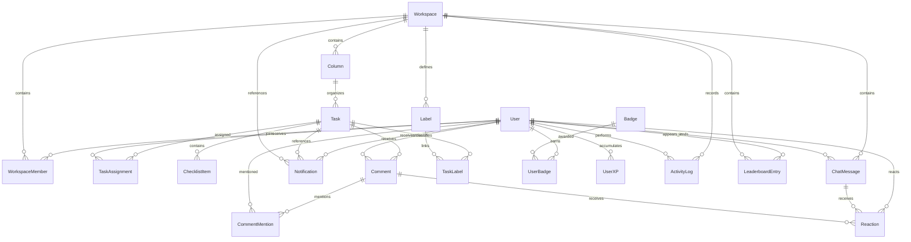

*This project has been created as part of the 42 curriculum by efinda, dnzita, cgama, jbofengo.*

# Description

**ft_prodd(...)** is a full-stack web application designed to improve how developers collaborate on group projects, with a strong focus on the workflow commonly experienced by **42 students**.

The name reflects both its purpose and its roots: the `ft_` prefix follows the traditional naming convention used across 42 projects, *prodd* comes from *productivity*, and the trailing `d` references Unix daemons — symbolizing a system that continuously runs in the background, tracking progress and activity. The `(...)` notation is inspired by function syntax, reinforcing the project’s programming-oriented identity.

The main goal of **ft_prodd(...)** is to provide a centralized platform where users can **organize, track, and improve their project workflow**, reducing common issues such as poor coordination, lack of visibility, and last-minute surprises during evaluation.

While the platform is inspired by and tailored to the needs of 42 students, **it is open to any user** who wants to manage collaborative projects in a structured and efficient way.

The application combines task management, collaboration tools, and real-time features into a single environment. It allows multiple users to interact simultaneously, manage shared workspaces, and monitor project progress as it evolves.

### Key Features

- **Task Management System**  
  Create, assign, and track tasks within project workspaces, ensuring clear visibility of what has been completed and what remains.

- **Real-Time Collaboration**  
  Live updates and interactions between users using WebSocket-based communication, enabling synchronized teamwork.

- **User Interaction System**  
  Profiles, friendships, and integrated chat allow team members to communicate and coordinate directly within the platform.

- **Project Knowledge Sharing**  
  Access to template projects and curated references from other students to better understand project requirements and best practices.

- **Testing Awareness**  
  Encourage early testing and validation during development to avoid unexpected issues during project evaluation.

- **Gamification System**  
  Users are rewarded for completing tasks, introducing a lightweight motivational layer to improve engagement and productivity.

- **Multi-user Environment**  
  Designed to support concurrent users working on shared projects without conflicts or data inconsistency.


# Instructions

This section explains how to **set up, configure, and run** the project locally.

The project is fully containerized using **Docker** and managed through a **Makefile**, which provides a simplified interface for all commands.

---

## Prerequisites

Before running the project, make sure you have the following installed:

* **Docker**
* **Docker Compose**
* **Make**

> All services run inside containers, so no manual installation of Node.js, PostgreSQL, or other dependencies is required on the host machine.

---

## Project Setup

Clone the repository and navigate to the project root:

```bash
git clone <repository_url> ft_prodd
cd ft_prodd
```

---

## Environment Configuration

The project uses environment variables for configuration.

A `.env.example` file is provided as a **template**, containing all the required environment variable names. The values in this file are placeholders and must be configured before running the project.

Since the `.env` file is ignored by Git, it will not be present when cloning the repository.

You have two options:

### Option 1: Manual Setup

Create a `.env` file inside the `config/` directory and define all variables based on `.env.example`:

```bash
cp config/.env.example config/.env
```

Then edit the file and replace all placeholder values with your desired configuration.

---

### Option 2: Automatic Setup (Recommended)

The `.env` file can be automatically generated during the initial project setup process.

If no `.env` file exists, it will be created from `.env.example`.

---

You can review or modify the environment variables at any time:

```bash
config/.env
```

---

## Running the Project

To perform the initial setup and start all services:

```bash
make setup
```

This command will:

* Generate a `.env` file if it does not exist
* Prepare the environment
* Build all services
* Start the containers

---

To start the project:

```bash
make up
```

To stop all services:

```bash
make down
```

---

## Development Workflow

The Makefile provides commands to simplify development and debugging.

### General Commands

```bash
make help
make ps
make logs
make health
```

---

### Development Mode

```bash
make dev
```

Runs the project with visible logs for easier debugging. This starts the frontend development server through the dev profile, without nginx.

To choose the frontend mode directly with Compose:

```bash
docker compose -f config/docker-compose.yaml up frontend
docker compose --profile dev -f config/docker-compose.yaml up frontend-dev
```

By default, frontend development listens on port 5173 in the container and is published on port 5173 on the host. You can change the host port with FRONTEND_DEV_PORT.

---

### Logs per Service

```bash
make logs-backend
make logs-frontend
make logs-db
make logs-redis
```

---

### Database Management

```bash
make db-shell
make migrate
make prisma-migrate
make prisma-generate
make prisma-studio
```

---

### Testing

```bash
make test-all
make test-backend
make test-frontend
make test-coverage
```

---

### Maintenance & Reset

```bash
make restart
make rebuild
make clean
```

⚠️ Destructive commands:

```bash
make reset-db
make reset-all
```

---

## Project Structure (Overview)

```bash
backend/
frontend/
config/
scripts/
Makefile
```

* **config/docker-compose.yaml** → Defines all services
* **scripts/** → Helper scripts used by the Makefile

---

## Notes

* The project is designed to run with a **single command** (`make setup`) as required by the subject.
* All services run inside Docker containers.
* The Makefile abstracts Docker commands to provide a simpler and consistent workflow.

---

## Future Extensions

This section is designed to be incrementally updated as new features are added, such as:

* New services
* Additional environment variables
* New Makefile commands
* Deployment instructions


# Resources

In this section, you have access to the main resources that helped us develop this project:

## Team Organization and Project Management

- [Project Manager vc Product Owner](https://youtu.be/2DwP_3gBGeQ?si=LaIiU4pE2RX_cpnD) — Youtube

- [Product Manager vs Project Manager - Project Management Training](https://youtu.be/WGvj_I2L020?si=HpxTi7Bkj9ocWPpb) — Youtube

- [Product Owner or Tech Lead, Not Both](https://chris-hand.medium.com/product-owner-lead-engineer-absolute-power-c00323c96b66) — Medium

- [Scrum vs Kanban - What's the Difference?](https://youtu.be/rIaz-l1Kf8w?si=qtOJpXPLZoCcXz0h) — Youtube

- [Basics of Kanban Boards for Project Management with Ricardo Vargas](https://youtu.be/XpK1vXM5Dd0?si=2e1jMqJp8zzNrkUs) — Youtube

- [What is a sprint (software development)?](https://www.techtarget.com/searchsoftwarequality/definition/Scrum-sprint) — TechTarget

- [Trello Tutorial in Ten Minutes (How to Use Trello to Get Your Life Together)](https://youtu.be/en3z928rwus?si=SJI1De0LO2RZApAj) — Youtube


## Frontend

- [The State of State Management in React (useState, Context API, Zustand...)](https://www.youtube.com/watch?v=qqqyUTTS-9g) — Youtube

- [React Query Crash Course - Learn Queries, Mutations, Caching, Optimistic Updates...](https://www.youtube.com/watch?v=e74rB-14-m8) — Youtube

- [React State Management in 2025: What You Actually Need](https://www.developerway.com/posts/react-state-management-2025) — developerway

- [Quickstart Guide](https://dndkit.com/quickstart/) — dndkit

### AI Usage

- 


## Backend

- [CI/CD Explained: The DevOps Skill That Makes You 10x More Valuable](https://www.youtube.com/watch?v=AknbizcLq4w) — Youtube

- [Teste de integração no Node com Jest e SuperTest](https://www.youtube.com/watch?v=L9rHlPtNi3g) — Youtube

- [Criando testes na aplicação com Jest e SuperTest - Code/drops #93](https://www.youtube.com/watch?v=18Dgf7lb9QA) — Youtube

### AI Usage

- 


## Database

- [Aprenda em 13:37: Prisma](https://www.youtube.com/watch?v=uApCW1gcpdE&t=16s) — Youtube

### AI Usage

- 


# Team Information

This section outlines the roles and core responsibilities of each team member within the project.

---

## *efinda* — Project Manager & Frontend Developer

* Oversees project planning, coordination, and progress tracking
* Ensures team communication and alignment
* Contributes to frontend development and user interface implementation

---

## *dnzita* — Product Owner & Developer

* Defines product vision and feature priorities
* Manages and validates the project backlog
* Contributes to both frontend and backend development

---

## *cgama* — Technical Lead & Backend Developer

* Designs system architecture and technical decisions
* Defines development standards and best practices
* Leads backend development and infrastructure setup

---

## *jbofengo* — Backend Developer

* Implements backend features and APIs
* Ensures code quality and reliability on the server side
* Supports testing and backend maintenance

---


# Project Management

## How We Organize Our Work

We follow the **Agile Kanban methodology** to manage our workflow efficiently. Our process works like this:

At the project's start, we break down all required work into small, manageable tasks — what we call "**salami slicing**" the work. These slices are distributed across team members based on their specific roles (PM, PO, Tech Lead, Dev).

**Our bi-weekly meeting rhythm:**

- **Monday @ 12:00 PM - Sprint Planning:** We select task slices from the backlog and distribute them among team members to work on throughout the week. Each member knows exactly what they need to "eat" (complete) before Friday.

- **Friday @ 6:00 PM - Sprint Review:** We check if all the salami slices distributed on Monday were successfully "eaten" (completed). Members demonstrate their completed work, the Product Owner validates functionality, and the Technical Lead reviews code quality.

This cadence keeps everyone accountable and ensures continuous progress without overwhelming any single team member.

## Project Management Tools

We use **Trello** as our Kanban board platform. The board is shared among all team members, providing complete visibility into the project's state.

Our Trello board structure:
- **Backlog** - All upcoming tasks waiting to be picked up
- **To Do** - Tasks assigned for the current sprint
- **In Progress** - Work currently being developed
- **Review** - Completed work awaiting validation
- **Done** - Validated and merged work

Team members move their assigned cards across columns as they progress, giving everyone real-time visibility into what's being worked on, what's blocked, and what's completed.

## Communication Channels

We use a **two-channel communication strategy** to balance urgency and organization:

### **WhatsApp Group - Quick Communication**
Used for time-sensitive messages and urgent coordination. Since most team members check WhatsApp frequently throughout the day, it's our go-to for:
- Urgent blockers or issues
- Last-minute meeting changes
- Quick yes/no questions
- General team coordination

### **Slack Workspace - Structured Work Discussion**
Our primary platform for organized, topic-specific communication. The workspace is divided into focused channels:

- **#avisos** - Team-wide announcements and important updates
- **#standup-check-in** - Weekly progress updates (mandatory Wednesday check-in)
- **#frontend** - React, UI/UX, and component discussions
- **#backend** - API, database, and server-side topics
- **#devops** - Docker, deployment, and infrastructure
- **#review** - Features reviews and technical feedback
- **#docs-and-resources** - Documentation, tutorials, and learning materials

This dual-channel approach ensures we never miss urgent issues (WhatsApp) while keeping technical discussions organized and searchable (Slack).


# Technical Stack

The technology stack was selected to ensure efficient development within a 4-person team, while meeting all subject requirements and supporting a scalable, real-time, multi-user application.

---

## Frontend

* **Framework:** React (with Vite)
* **Styling:** Tailwind CSS

React provides a component-based architecture suitable for building dynamic user interfaces, while Vite ensures fast development and build performance. Tailwind CSS enables rapid UI development with a consistent and maintainable design system.

---

## Backend

* **Runtime & Framework:** Node.js with Express

Express is a lightweight and flexible backend framework used to build RESTful APIs. It integrates easily with real-time communication layers and middleware for authentication, security, and request handling.

---

## Database

* **System:** PostgreSQL

PostgreSQL was chosen for its reliability, strong consistency, and support for relational data models. It is well-suited for multi-user environments and complex queries, ensuring data integrity across the application.

---

## Additional Technologies

* **ORM:** Prisma
* **Real-Time Communication:** Socket.IO
* **Authentication:** JWT + bcrypt
* **Containerization:** Docker + Docker Compose
* **Reverse Proxy / HTTPS:** Nginx

Prisma simplifies database interaction through type-safe queries and automated migrations. Socket.IO enables real-time features such as chat and live updates. JWT and bcrypt provide secure authentication mechanisms. Docker ensures consistent environments and allows the application to run with a single command. Nginx handles HTTPS and request routing.

---

## Justification of Technical Choices

The stack is based on a unified **TypeScript ecosystem**, allowing both frontend and backend to share the same language. This reduces context switching and improves team collaboration.

A **monolithic architecture** was chosen to simplify development, deployment, and debugging within the project’s time constraints. It minimizes system complexity while maintaining sufficient flexibility for all required features.

The combination of **React, Express, and PostgreSQL** provides a balanced architecture capable of handling real-time interactions, structured data, and multi-user concurrency.

---

## Compatibility with Subject Requirements

| Requirement        | Technology Used             |
| ------------------ | --------------------------- |
| Frontend Framework | React + Vite                |
| Backend Framework  | Express (Node.js)           |
| Database           | PostgreSQL                  |
| Real-time Features | Socket.IO                   |
| User Management    | JWT + bcrypt                |
| Security           | Helmet, CORS, Rate Limiting |
| Docker Deployment  | Docker Compose              |
| HTTPS              | Nginx                       |
| Multi-user Support | PostgreSQL                  |
| Architecture       | Monolithic (Express)        |


# Database Schema

The application uses **PostgreSQL** with **Prisma ORM**.
The schema is designed to support task management, workspace collaboration, real-time communication, and gamification features.

---

## Structure Overview

The database is organized around the following core concepts:

* **User**: Represents each platform user
* **Workspace**: Groups users, tasks, and collaborative data
* **Column**: Defines task organization within a workspace (Kanban structure)
* **Task**: Central entity representing work items

Additional tables handle relationships, communication, and gamification features.

---

## Visual Representation



---

## Tables and Relationships

### Core Entities

| Table             | Description                          | Key Fields                                                    |
| ----------------- | ------------------------------------ | ------------------------------------------------------------- |
| `User`            | Platform users                       | `id`, `username`, `email`, `passwordHash`, `totalXp`, `createdAt`       |
| `Workspace`       | Collaborative workspace              | `id`, `name`, `description`, `totalTask`, `createdAt`        |
| `WorkspaceMember` | Links users to workspaces with roles | `id`, `workspaceId`, `userId`, `role`                        |

---

### Task Management (Kanban)

| Table            | Description                      | Key Fields                                                                              |
| ---------------- | -------------------------------- | --------------------------------------------------------------------------------------- |
| `Column`         | Task grouping inside a workspace | `id`, `workspaceId`, `name`, `order`                                                    |
| `Task`           | Main task entity                 | `id`, `columnId`, `title`, `description`, `priority`, `dueDate`, `isDone`, `dateCompleted`, `orderInColumn` |
| `TaskAssignment` | Assigns tasks to users           | `taskId`, `userId`                                                                      |
| `ChecklistItem`  | Task checklist items             | `id`, `taskId`, `text`, `isCompleted`                                                   |
| `Label`          | Reusable labels                  | `id`, `workspaceId`, `name`, `color`                                                    |
| `TaskLabel`      | Task-label relationship          | `taskId`, `labelId`                                                                     |

---

### Communication and Activity

| Table            | Description               | Key Fields                                 |
| ---------------- | ------------------------- | ------------------------------------------ |
| `Comment`        | Task comments             | `id`, `taskId`, `authorId`, `content`      |
| `CommentMention` | User mentions in comments | `id`, `commentId`, `userId`                |
| `Notification`   | System notifications      | `id`, `userId`, `type`, `isRead`           |
| `ChatMessage`    | Workspace chat messages   | `id`, `workspaceId`, `senderId`, `content` |
| `Reaction`       | Emoji reactions           | `id`, `emoji`, `userId`                    |
| `ActivityLog`    | User actions history      | `id`, `workspaceId`, `userId`, `action`    |

---

### Gamification

| Table              | Description            | Key Fields                                |
| ------------------ | ---------------------- | ----------------------------------------- |
| `Badge`            | Badge definitions      | `id`, `name`, `description`               |
| `UserBadge`        | Badges earned by users | `userId`, `badgeId`                       |
| `UserXP`           | User experience points | `userId`, `xp`                            |
| `LeaderboardEntry` | Ranking per workspace  | `userId`, `workspaceId`, `xpWeek`, `rank` |

---

## Data Types

The schema uses the following main data types:

* **Int**: identifiers, ordering, ranking, XP values
* **String**: names, descriptions, content, URLs
* **Boolean**: state flags (e.g., `isCompleted`, `isRead`, `isDone`)
* **DateTime**: timestamps for entity creation, updates, deadlines (e.g., `dueDate`, `dateCompleted`)
* **Enum**: categorical values (e.g., `WorkspaceRole`, `NotificationType`, `Priority`)

### Enums

* `WorkspaceRole`: `admin`, `member`, `guest`
* `NotificationType`: `mention`, `taskAssignment`, `comment`, `invite`
* `Priority`: `LOW`, `MEDIUM`, `HIGH`

---

## Modeling Rules

* All entities use an auto-increment `id` as the primary key
* `email` and `username` in `User` are unique
* Many-to-many relationships are handled through junction tables
* Optional fields are used to support flexible relationships (e.g., notifications and reactions)


# Features List

This section lists all implemented features of the project, along with their description and responsible team members.

---

## Core Features

| Feature                  | Description                                                                                                | Implemented By                                         |
| ------------------------ | ---------------------------------------------------------------------------------------------------------- | ------------------------------------------------------ |
| **User Authentication**  | Allows users to register, log in, and securely authenticate using JWT-based sessions and password hashing. | efinda (Frontend), jbofengo (Backend)                  |
| **User Profiles**        | Provides user profile management, including personal information and avatar customization.                 |                                                        |
| **Workspace Management** | Enables users to create and manage collaborative workspaces.                                               |                                                        |
| **Workspace Membership** | Allows users to join workspaces with specific roles and permissions.                                       |                                                        |

---

## Task Management (Kanban System)

| Feature                        | Description                                                               | Implemented By |
| ------------------------------ | ------------------------------------------------------------------------- | -------------- |
| **Kanban Board**               | Visual task management system using columns to represent workflow stages. |                |
| **Task Creation & Management** | Create, update, delete, and organize tasks within columns.                |                |
| **Task Assignment**            | Assign tasks to one or multiple users.                                    |                |
| **Task Checklist**             | Add checklist items to tasks and track their completion.                  |                |
| **Task Labels**                | Categorize tasks using labels for better organization.                    |                |

---

## Communication Features

| Feature             | Description                                                                       | Implemented By |
| ------------------- | --------------------------------------------------------------------------------- | -------------- |
| **Task Comments**   | Users can comment on tasks for discussion and collaboration.                      |                |
| **Mentions System** | Users can mention others in comments to notify them.                              |                |
| **Workspace Chat**  | Real-time messaging system within workspaces.                                     |                |
| **Reactions**       | Users can react to messages and comments using emojis.                            |                |
| **Notifications**   | System-generated notifications for relevant events (mentions, assignments, etc.). |                |

---

## Gamification

| Feature                    | Description                                          | Implemented By |
| -------------------------- | ---------------------------------------------------- | -------------- |
| **Experience Points (XP)** | Users earn XP based on completed tasks and activity. |                |
| **Badges System**          | Users earn badges for achievements and milestones.   |                |
| **Leaderboard**            | Displays rankings of users based on activity and XP. |                |

---

## System & Infrastructure

| Feature                    | Description                                                               | Implemented By         |
| -------------------------- | ------------------------------------------------------------------------- | ---------------------- |
| **Real-Time Updates**      | Synchronizes application state across users using WebSockets (Socket.IO). |                        |
| **Dockerized Environment** | Full application runs in containers with a single command.                | cgama                  |
| **Secure API**             | Backend secured with middleware (JWT, rate limiting, CORS, Helmet).       | jbofengo               |
| **Database Integration**   | Persistent data storage using PostgreSQL with Prisma ORM.                 | dnzita                 |

---

## Notes

* This section is continuously updated as new features are implemented.
* Each feature should be updated with the responsible team member(s) once completed.


# Modules

## Organization System Module

This module provides complete workspace management capabilities, allowing users to create, edit, and delete workspaces, as well as manage workspace members with role-based access control.

### Overview

The Organization System is the core module for managing organizational units within the application. It enables:
- **Workspace Creation**: Users can create new workspaces and automatically become administrators
- **Workspace Management**: Admins can update workspace details and delete workspaces
- **Member Management**: Admins can add and remove members, assign roles
- **Role-Based Access Control (RBAC)**: Three roles with specific permissions (`admin`, `member`, `guest`)

### Implemented API Routes

#### Workspace CRUD Operations

- **`POST /api/workspaces`** - Create Workspace
  - Request: `{ name: string, description?: string }`
  - Response: `201 Created` - New workspace data
  - Creates a new workspace and automatically adds the creator as admin
  - Uses transaction to ensure atomicity
  
- **`GET /api/workspaces`** - List User Workspaces
  - Returns all workspaces where the authenticated user is a member
  - Includes user's role in each workspace
  
- **`GET /api/workspaces/:id`** - Get Workspace Details
  - Returns workspace details with user's role
  - Only accessible to workspace members
  
- **`PUT /api/workspaces/:id`** - Update Workspace
  - Request: `{ name?: string, description?: string }`
  - Admin-only operation
  - Updates workspace details atomically with activity logging
  
- **`DELETE /api/workspaces/:id`** - Delete Workspace
  - Admin-only operation
  - Deletes workspace and all related data (members, activity logs) atomically
  - Prevents cascading delete errors through careful transaction management

#### Member Management

- **`POST /api/workspaces/:id/members`** - Add Member
  - Request: `{ userId: number, role?: "admin" | "member" | "guest" }`
  - Admin-only operation
  - Validates user exists and is not already a member
  - Adds member atomically with activity logging
  - Defaults to "member" role if not specified
  
- **`GET /api/workspaces/:id/members`** - List Members
  - Returns all members of a workspace
  - Accessible to any workspace member
  
- **`GET /api/workspaces/:id/members/:userId`** - Get Member Details
  - `admin` and `member`: Can view any member
  - `guest`: Can only view their own profile
  
- **`PUT /api/workspaces/:id/members/:userId`** - Update Member Role
  - Admin-only operation
  - Prevents removing the last admin of a workspace
  - Updates role atomically with activity logging
  
- **`DELETE /api/workspaces/:id/members/:userId`** - Remove Member
  - Admin-only operation
  - Prevents removing the last admin of a workspace
  - Removes member atomically with activity logging

### Role-Based Access Control (RBAC)

The module implements three roles with specific permissions:

| Role | Create Workspace | Update Workspace | Delete Workspace | Add Members | Remove Members | View Members | View Own Profile |
|------|-----------------|-----------------|-----------------|------------|----------------|-------------|-----------------|
| **admin** | Yes* | Yes | Yes | Yes | Yes | Yes | Yes |
| **member** | Yes* | No | No | No | No | Yes | Yes |
| **guest** | Yes* | No | No | No | No | Yes | Yes (only own) |

*Authenticated users can create workspaces (automatically becoming admin)

### Input Validation

All inputs are validated server-side using Zod schemas:

```typescript
// Workspace creation/update
createWorkspaceSchema: {
  name: string (1-255 characters)
  description?: string (0-1000 characters)
}

// Member addition
addWorkspaceMemberSchema: {
  userId: positive integer
  role?: "admin" | "member" | "guest" (defaults to "member")
}

// All ID parameters (workspaceId, userId)
  must be positive integers
```

Validation errors return HTTP `400` with descriptive messages.

### Transaction Safety

Multiple operations are wrapped in Prisma transactions to ensure data consistency:

- **Workspace Creation**: Creates workspace + adds creator as admin + logs activity atomically
- **Workspace Deletion**: Deletes activity logs + removes members + deletes workspace atomically
- **Member Addition**: Creates membership + updates workspace timestamp + logs activity atomically
- **Member Removal**: Deletes membership + updates workspace timestamp + logs activity atomically + prevents last-admin removal

Transaction safety prevents:
- Partial writes under concurrent requests
- Data corruption from failed operations
- Inconsistent state between related records

### Data Protection

- **Last Admin Protection**: Cannot remove or demote the last admin of a workspace
- **User Existence Validation**: Cannot add non-existent users to workspace
- **Duplicate Prevention**: Cannot add users who are already workspace members
- **Permission Enforcement**: Operations respect user roles (RBAC)

### Activity Logging

All workspace and member operations are logged for auditing:
- Workspace creation, updates, and deletion
- Member additions and removals
- Member role changes
- Timestamps and user IDs recorded for all operations

### Testing

Comprehensive test suite covering:

- Workspace CRUD operations (create, read, update, delete)
- Member management (add, remove, update roles)
- RBAC enforcement (admin-only operations)
- Last admin protection
- Input validation and error handling
- Transaction safety and atomicity
- Guest user restrictions
- Permission enforcement across all operations

Run tests:
```bash
npm test -- workspaces.test.ts
npm test -- --coverage
```

### Error Handling

The module returns appropriate HTTP status codes:

| Status | Scenario |
|--------|----------|
| 201 | Workspace or member created successfully |
| 200 | Operation successful |
| 400 | Invalid input or validation error |
| 403 | Permission denied (RBAC) or workspace membership required |
| 404 | Resource not found (workspace, user, or member) |

### Implementation Details

**File Locations:**
- Routes: [backend/src/routes/workspaces.ts](backend/src/routes/workspaces.ts)
- Validations: [backend/src/validations/workspace.ts](backend/src/validations/workspace.ts)
- RBAC Middleware: [backend/src/middleware/rbac.ts](backend/src/middleware/rbac.ts)
- Tests: [backend/src/routes/workspaces.test.ts](backend/src/routes/workspaces.test.ts)
- Database Schema: [backend/prisma/schema.prisma](backend/prisma/schema.prisma)

**Dependencies:**
- Express.js - Web framework
- Prisma - ORM with transaction support
- Zod - Input validation
- TypeScript - Type safety

## Advanced Permissions System

This module enforces workspace-level RBAC (Role-Based Access Control) using the roles defined in Prisma: `admin`, `member`, and `guest`.

### Implemented API routes

- `GET /api/workspaces`
  - Returns only workspaces where the authenticated user is a member.
  - Includes the user role in each workspace record.

- `GET /api/workspaces/:id`
  - Returns workspace details only if the authenticated user belongs to that workspace.

- `GET /api/workspaces/:id/members`
  - Returns workspace members and their roles if requester belongs to workspace.

- `GET /api/workspaces/:id/members/:userId`
  - `admin` and `member`: can view any member in the workspace.
  - `guest`: can view only their own membership profile.

- `PUT /api/workspaces/:id/members/:userId`
  - Admin-only route for role updates (`admin`, `member`, `guest`).
  - Prevents removing/demoting the last admin of a workspace.

- `DELETE /api/workspaces/:id/members/:userId`
  - Admin-only route to remove a member from workspace.
  - Prevents removing the last admin of a workspace.

### Server-side validation

- All route params (`:id`, `:userId`) are validated as positive integers with Zod.
- Body payload for role updates is validated against allowed enum values.
- Invalid input returns HTTP `400` with validation details.

### Transaction safety (Prisma)

Operations with multiple writes are executed inside `prisma.$transaction(...)`:

- Member role updates (`PUT`) update membership + workspace timestamp + activity log atomically.
- Member removal (`DELETE`) deletes membership + updates workspace timestamp + activity log atomically.

This prevents partial writes and data corruption under concurrent usage.

### Tests

Automated tests cover:

- Listing user workspaces.
- Input validation failures.
- Role-based restrictions (`guest` and non-admin behavior).
- Successful admin role update with transaction execution.
- Protection against removing the last workspace admin.


# Individual Contributions

This section provides a detailed breakdown of each team member’s contributions throughout the project, including implemented features, modules, and challenges encountered.

---

## efinda (Project Manager / Frontend Developer)

### Contributions

* Defined and presented the initial project idea
* Led project organization and coordination:

  * Created communication channels (WhatsApp, Slack workspace with structured channels and rules)
  * Set up project management tools (Trello Kanban board for planning and tracking progress)
  * Organized and led team meetings
* Defined development workflow:

  * Created commit message guidelines
  * Established code-review rules
  * Reviewed, validated, and merged code after approval
* Frontend development:

  * Implemented authentication interfaces
  * Developed user profile and social pages
* Documentation:

  * Structured and wrote the project README.md
  * Ensured documentation consistency and alignment with subject requirements

### Implemented Features / Modules

* User Authentication (Frontend)
* User Profiles
* Social / User Interaction Pages

---

### Challenges & Solutions

* **Challenge:** Coordinating a team workflow and maintaining consistency across contributions
* **Solution:** Defined clear guidelines (commit rules, code review process) and structured communication channels to ensure alignment
* **Challenge:** Maintaining clear and structured documentation throughout the project
* **Solution:** Designed an incremental README structure that is updated alongside development progress

---

## dnzita (Project Owner / Developer)

### Contributions

* Designed and conducted a user research form to gather requirements from students
* Analyzed form results and contributed to module selection
* Backend and frontend feature development:

  * Implemented notifications system
  * Developed workspace-related pages
* Designed the database schema using Prisma

### Implemented Features / Modules

* Notifications System
* Workspace Management
* Database Schema Design

---

### Challenges & Solutions

* **Challenge:** Translating user needs into concrete features and modules
* **Solution:** Structured feedback collection through forms and mapped results to actionable module decisions

---

## cgama (Technical Leader / Backend Developer)

### Contributions

* Designed the overall technical architecture of the project
* Selected the technology stack
* Set up the entire development environment:

  * Defined project structure
  * Created Dockerfiles and Docker Compose configuration
  * Implemented Makefile and automation scripts
* Established infrastructure for scalable and consistent development

### Implemented Features / Modules

* Project Infrastructure (Docker, Makefile, Scripts)
* System Architecture Design
* Technical Stack Definition

---

### Challenges & Solutions

* **Challenge:** Creating a development environment that is consistent across all team members
* **Solution:** Containerized the entire application using Docker and centralized commands through the Makefile

---

## jbofengo (Backend Developer)

### Contributions

* Implemented backend authentication logic
* Developed secure API endpoints for user authentication

### Implemented Features / Modules

* User Authentication (Backend)

---

### Challenges & Solutions

* **Challenge:** Ensuring secure authentication and proper handling of user credentials
* **Solution:** Implemented JWT-based authentication with password hashing using bcrypt

---

## Team Collaboration

### Contributions

* All team members participated in code reviews
* Collaboratively validated implementations before merging into the main codebase

---

## Notes

* This section is updated continuously as the project progresses.
* Each team member is responsible for keeping their contributions accurate and up to date.
* Contributions should reflect **actual implemented work**, not planned tasks.
