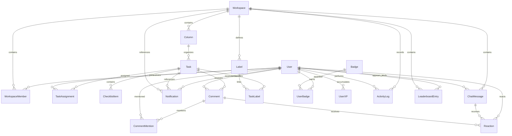

*This project has been created as part of the 42 curriculum by efinda, dnzita, cgama, jbofengo.*

# Description

**ft_prodd(...)** is a full-stack web application designed to improve how developers collaborate on group projects, with a strong focus on the workflow commonly experienced by **42 students**.

The name reflects both its purpose and its roots: the `ft_` prefix follows the traditional naming convention used across 42 projects, *prodd* comes from *productivity*, and the trailing `d` references Unix daemons — symbolizing a system that continuously runs in the background, tracking progress and activity. The `(...)` notation is inspired by function syntax, reinforcing the project’s programming-oriented identity.

The main goal of **ft_prodd(...)** is to provide a centralized platform where users can **organize, track, and improve their project workflow**, reducing common issues such as poor coordination, lack of visibility, and last-minute surprises during evaluation.

While the platform is inspired by and tailored to the needs of 42 students, **it is open to any user** who wants to manage collaborative projects in a structured and efficient way.

The application combines task management, collaboration tools, and real-time features into a single environment. It allows multiple users to interact simultaneously, manage shared workspaces, and monitor project progress as it evolves.

### Key Features

- **Task Management System**  
  Create, assign, and track tasks within project workspaces, ensuring clear visibility of what has been completed and what remains.

- **Real-Time Collaboration**  
  Live updates and interactions between users using WebSocket-based communication, enabling synchronized teamwork.

- **User Interaction System**  
  Profiles, friendships, and integrated chat allow team members to communicate and coordinate directly within the platform.

- **Project Knowledge Sharing**  
  Access to template projects and curated references from other students to better understand project requirements and best practices.

- **Testing Awareness**  
  Encourage early testing and validation during development to avoid unexpected issues during project evaluation.

- **Gamification System**  
  Users are rewarded for completing tasks, introducing a lightweight motivational layer to improve engagement and productivity.

- **Multi-user Environment**  
  Designed to support concurrent users working on shared projects without conflicts or data inconsistency.


# Instructions

This section explains how to **set up, configure, and run** the project locally.

The project is fully containerized using **Docker** and managed through a **Makefile**, which provides a simplified interface for all commands.

---

## Prerequisites

Before running the project, make sure you have the following installed:

* **Docker**
* **Docker Compose**
* **Make**

> All services run inside containers, so no manual installation of Node.js, PostgreSQL, or other dependencies is required on the host machine.

---

## Project Setup

Clone the repository and navigate to the project root:

```bash
git clone <repository_url> ft_prodd
cd ft_prodd
```

---

## Environment Configuration

The project uses environment variables for configuration.

A `.env.example` file is provided as a **template**, containing all the required environment variable names. The values in this file are placeholders and must be configured before running the project.

Since the `.env` file is ignored by Git, it will not be present when cloning the repository.

You have two options:

### Option 1: Manual Setup

Create a `.env` file inside the `config/` directory and define all variables based on `.env.example`:

```bash
cp config/.env.example config/.env
```

Then edit the file and replace all placeholder values with your desired configuration.

---

### Option 2: Automatic Setup (Recommended)

The `.env` file can be automatically generated during the initial project setup process.

If no `.env` file exists, it will be created from `.env.example`.

---

You can review or modify the environment variables at any time:

```bash
config/.env
```

---

## Running the Project

To perform the initial setup and start all services:

```bash
make setup
```

This command will:

* Generate a `.env` file if it does not exist
* Prepare the environment
* Build all services
* Start the containers

---

To start the project:

```bash
make up
```

To stop all services:

```bash
make down
```

---

## Development Workflow

The Makefile provides commands to simplify development and debugging.

### General Commands

```bash
make help
make ps
make logs
make health
```

---

### Development Mode

```bash
make dev
```

Runs the project with visible logs for easier debugging.

---

### Logs per Service

```bash
make logs-backend
make logs-frontend
make logs-db
make logs-redis
```

---

### Database Management

```bash
make db-shell
make migrate
make prisma-migrate-new NAME=descricao_da_alteracao
make prisma-generate
make prisma-studio
```

#### Fluxo Prisma (importante para toda a equipa)

**Depois de `git pull`** — aplicar migrations que alguém já criou:

```bash
make migrate
```

**Quando alteras `backend/prisma/schema.prisma`** — criar e commitar a nova migration:

```bash
make prisma-migrate-new NAME=descricao_curta
git add backend/prisma/migrations/ backend/prisma/schema.prisma
git commit -m "feat(db): descricao da alteracao"
```

**Se `make migrate` falhar com P3009** (migration falhada no teu banco local):

```bash
make reset-db   # apaga dados locais e reaplica tudo do zero
```

Regras para evitar problemas:

- **Nunca apagar** pastas em `backend/prisma/migrations/` — isso partiu o projeto (só ficou uma migration incremental sem as tabelas base).
- **Nunca usar** `prisma db push` em desenvolvimento partilhado — usa sempre `make prisma-migrate-new`.
- **Sempre commitar** a pasta `migrations/` inteira (incluindo `migration_lock.toml`), não só o `schema.prisma`.
- Usar **WSL Ubuntu** para correr o Makefile: `wsl -d Ubuntu` antes dos comandos `make`.

---

### Testing

```bash
make test-all
make test-backend
make test-frontend
make test-coverage
```

---

### Maintenance & Reset

```bash
make restart
make rebuild
make clean
```

⚠️ Destructive commands:

```bash
make reset-db
make reset-all
```

---

## Project Structure (Overview)

```bash
backend/
frontend/
config/
scripts/
Makefile
```

* **config/docker-compose.yaml** → Defines all services
* **scripts/** → Helper scripts used by the Makefile

---

## Notes

* The project is designed to run with a **single command** (`make setup`) as required by the subject.
* All services run inside Docker containers.
* The Makefile abstracts Docker commands to provide a simpler and consistent workflow.

---

## Future Extensions

This section is designed to be incrementally updated as new features are added, such as:

* New services
* Additional environment variables
* New Makefile commands
* Deployment instructions


# Resources

In this section, you have access to the main resources that helped us develop this project:

## Team Organization and Project Management

- [Project Manager vc Product Owner](https://youtu.be/2DwP_3gBGeQ?si=LaIiU4pE2RX_cpnD) — Youtube

- [Product Manager vs Project Manager - Project Management Training](https://youtu.be/WGvj_I2L020?si=HpxTi7Bkj9ocWPpb) — Youtube

- [Product Owner or Tech Lead, Not Both](https://chris-hand.medium.com/product-owner-lead-engineer-absolute-power-c00323c96b66) — Medium

- [Scrum vs Kanban - What's the Difference?](https://youtu.be/rIaz-l1Kf8w?si=qtOJpXPLZoCcXz0h) — Youtube

- [Basics of Kanban Boards for Project Management with Ricardo Vargas](https://youtu.be/XpK1vXM5Dd0?si=2e1jMqJp8zzNrkUs) — Youtube

- [What is a sprint (software development)?](https://www.techtarget.com/searchsoftwarequality/definition/Scrum-sprint) — TechTarget

- [Trello Tutorial in Ten Minutes (How to Use Trello to Get Your Life Together)](https://youtu.be/en3z928rwus?si=SJI1De0LO2RZApAj) — Youtube


## Frontend

- [How browsers work](https://web.dev/articles/howbrowserswork) — web.dev

- [The State of State Management in React (useState, Context API, Zustand...)](https://www.youtube.com/watch?v=qqqyUTTS-9g) — Youtube

- [React Query Crash Course - Learn Queries, Mutations, Caching, Optimistic Updates...](https://www.youtube.com/watch?v=e74rB-14-m8) — Youtube

- [React State Management in 2025: What You Actually Need](https://www.developerway.com/posts/react-state-management-2025) — developerway

- [Quickstart Guide](https://dndkit.com/quickstart/) — dndkit

- [Graph vs Chart: What’s the Difference?](https://blacklabel.net/blog/data-visualization/chart-types/graph-vs-chart-whats-the-difference/) — blacklabel.net

### AI Usage

- 


## Backend

- [CI/CD Explained: The DevOps Skill That Makes You 10x More Valuable](https://www.youtube.com/watch?v=AknbizcLq4w) — Youtube

- [Teste de integração no Node com Jest e SuperTest](https://www.youtube.com/watch?v=L9rHlPtNi3g) — Youtube

- [Criando testes na aplicação com Jest e SuperTest - Code/drops #93](https://www.youtube.com/watch?v=18Dgf7lb9QA) — Youtube

- [Crypto module](https://nodejs.org/api/crypto.html#cryptorandombytessize-callback) — nodejs.org

### AI Usage

- **Public API:** it helped to design and implement the API with code snippets for secure key authentication (creation and storage) and rate limiting in Express, together with a comprehensive documentation.

- **OAuth 2.0:** it helped implement the OAuth 2.0 authentication flow, including user redirection to the 42 authorization page, callback handling, authorization code exchange, access token retrieval, and user information fetching from the 42 API.

- **SignIn and SignUp:** it helped implement the authentication system, including password hashing with bcrypt, JWT-based session authentication, request parsing and validation, TypeScript typing, and schema validation with Zod. It also helped structure the backend into routes, controllers, and middleware to improve maintainability and scalability.

## Database

- [Aprenda em 13:37: Prisma](https://www.youtube.com/watch?v=uApCW1gcpdE&t=16s) — Youtube

### AI Usage

- 


# Team Information

This section outlines the roles and core responsibilities of each team member within the project.

---

## *efinda* — Project Manager & Developer

* Oversees project planning, coordination, and progress tracking
* Ensures team communication and alignment
* Contributes to frontend development and user interface implementation

---

## *dnzita* — Product Owner & Developer

* Defines product vision and feature priorities
* Manages and validates the project backlog
* Contributes to both frontend and backend development

---

## *cgama* — Technical Lead & Backend Developer

* Designs system architecture and technical decisions
* Defines development standards and best practices
* Leads backend development and infrastructure setup

---

## *jbofengo* — Backend Developer

* Implements backend features and APIs
* Ensures code quality and reliability on the server side
* Supports testing and backend maintenance

---


# Project Management

## How We Organize Our Work

We follow the **Agile Kanban methodology** to manage our workflow efficiently. Our process works like this:

At the project's start, we break down all required work into small, manageable tasks — what we call "**salami slicing**" the work. These slices are distributed across team members based on their specific roles (PM, PO, Tech Lead, Dev).

**Our bi-weekly meeting rhythm:**

- **Monday @ 12:00 PM - Sprint Planning:** We select task slices from the backlog and distribute them among team members to work on throughout the week. Each member knows exactly what they need to "eat" (complete) before Friday.

- **Friday @ 6:00 PM - Sprint Review:** We check if all the salami slices distributed on Monday were successfully "eaten" (completed). Members demonstrate their completed work, the Product Owner validates functionality, and the Technical Lead reviews code quality.

This cadence keeps everyone accountable and ensures continuous progress without overwhelming any single team member.

## Project Management Tools

We use **Trello** as our Kanban board platform. The board is shared among all team members, providing complete visibility into the project's state.

Our Trello board structure:
- **Backlog** - All upcoming tasks waiting to be picked up
- **To Do** - Tasks assigned for the current sprint
- **In Progress** - Work currently being developed
- **Review** - Completed work awaiting validation
- **Done** - Validated and merged work

Team members move their assigned cards across columns as they progress, giving everyone real-time visibility into what's being worked on, what's blocked, and what's completed.

## Communication Channels

We use a **two-channel communication strategy** to balance urgency and organization:

### **WhatsApp Group - Quick Communication**
Used for time-sensitive messages and urgent coordination. Since most team members check WhatsApp frequently throughout the day, it's our go-to for:
- Urgent blockers or issues
- Last-minute meeting changes
- Quick yes/no questions
- General team coordination

### **Slack Workspace - Structured Work Discussion**
Our primary platform for organized, topic-specific communication. The workspace is divided into focused channels:

- **#avisos** - Team-wide announcements and important updates
- **#standup-check-in** - Weekly progress updates (mandatory Wednesday check-in)
- **#frontend** - React, UI/UX, and component discussions
- **#backend** - API, database, and server-side topics
- **#devops** - Docker, deployment, and infrastructure
- **#review** - Features reviews and technical feedback
- **#docs-and-resources** - Documentation, tutorials, and learning materials

This dual-channel approach ensures we never miss urgent issues (WhatsApp) while keeping technical discussions organized and searchable (Slack).


# Technical Stack

The technology stack was selected to ensure efficient development within a 4-person team, while meeting all subject requirements and supporting a scalable, real-time, multi-user application.

---

## Frontend

* **Framework:** React (with Vite)
* **Styling:** Tailwind CSS

React provides a component-based architecture suitable for building dynamic user interfaces, while Vite ensures fast development and build performance. Tailwind CSS enables rapid UI development with a consistent and maintainable design system.

---

## Backend

* **Runtime & Framework:** Node.js with Express

Express is a lightweight and flexible backend framework used to build RESTful APIs. It integrates easily with real-time communication layers and middleware for authentication, security, and request handling.

---

## Database

* **System:** PostgreSQL

PostgreSQL was chosen for its reliability, strong consistency, and support for relational data models. It is well-suited for multi-user environments and complex queries, ensuring data integrity across the application.

---

## Additional Technologies

* **ORM:** Prisma
* **Real-Time Communication:** Socket.IO
* **Authentication:** JWT + bcrypt
* **Containerization:** Docker + Docker Compose
* **Reverse Proxy / HTTPS:** Nginx

Prisma simplifies database interaction through type-safe queries and automated migrations. Socket.IO enables real-time features such as chat and live updates. JWT and bcrypt provide secure authentication mechanisms. Docker ensures consistent environments and allows the application to run with a single command. Nginx handles HTTPS and request routing.

---

## Justification of Technical Choices

The stack is based on a unified **TypeScript ecosystem**, allowing both frontend and backend to share the same language. This reduces context switching and improves team collaboration.

A **monolithic architecture** was chosen to simplify development, deployment, and debugging within the project’s time constraints. It minimizes system complexity while maintaining sufficient flexibility for all required features.

The combination of **React, Express, and PostgreSQL** provides a balanced architecture capable of handling real-time interactions, structured data, and multi-user concurrency.

---

## Compatibility with Subject Requirements

| Requirement        | Technology Used             |
| ------------------ | --------------------------- |
| Frontend Framework | React + Vite                |
| Backend Framework  | Express (Node.js)           |
| Database           | PostgreSQL                  |
| Real-time Features | Socket.IO                   |
| User Management    | JWT + bcrypt                |
| Security           | Helmet, CORS, Rate Limiting |
| Docker Deployment  | Docker Compose              |
| HTTPS              | Nginx                       |
| Multi-user Support | PostgreSQL                  |
| Architecture       | Monolithic (Express)        |


# Database Schema

The application uses **PostgreSQL** with **Prisma ORM**.
The schema is designed to support task management, workspace collaboration, real-time communication, and gamification features.

---

## Structure Overview

The database is organized around the following core concepts:

* **User**: Represents each platform user
* **Workspace**: Groups users, tasks, and collaborative data
* **Column**: Defines task organization within a workspace (Kanban structure)
* **Task**: Central entity representing work items

Additional tables handle relationships, communication, and gamification features.

---

## Visual Representation



---

## Tables and Relationships

### Core Entities

| Table             | Description                          | Key Fields                                             |
| ----------------- | ------------------------------------ | ------------------------------------------------------ |
| `User`            | Platform users                       | `id`, `username`, `email`, `passwordHash`, `createdAt` |
| `Workspace`       | Collaborative workspace              | `id`, `name`, `description`, `createdAt`               |
| `WorkspaceMember` | Links users to workspaces with roles | `id`, `workspaceId`, `userId`, `role`                  |

---

### Task Management (Kanban)

| Table            | Description                      | Key Fields                                                |
| ---------------- | -------------------------------- | --------------------------------------------------------- |
| `Column`         | Task grouping inside a workspace | `id`, `workspaceId`, `name`, `order`                      |
| `Task`           | Main task entity                 | `id`, `columnId`, `title`, `description`, `orderInColumn` |
| `TaskAssignment` | Assigns tasks to users           | `taskId`, `userId`                                        |
| `ChecklistItem`  | Task checklist items             | `id`, `taskId`, `text`, `isCompleted`                     |
| `Label`          | Reusable labels                  | `id`, `workspaceId`, `name`, `color`                      |
| `TaskLabel`      | Task-label relationship          | `taskId`, `labelId`                                       |

---

### Communication and Activity

| Table            | Description               | Key Fields                                 |
| ---------------- | ------------------------- | ------------------------------------------ |
| `Comment`        | Task comments             | `id`, `taskId`, `authorId`, `content`      |
| `CommentMention` | User mentions in comments | `id`, `commentId`, `userId`                |
| `Notification`   | System notifications      | `id`, `userId`, `type`, `isRead`           |
| `ChatMessage`    | Workspace chat messages   | `id`, `workspaceId`, `senderId`, `content` |
| `Reaction`       | Emoji reactions           | `id`, `emoji`, `userId`                    |
| `ActivityLog`    | User actions history      | `id`, `workspaceId`, `userId`, `action`    |

---

### Gamification

| Table              | Description            | Key Fields                                |
| ------------------ | ---------------------- | ----------------------------------------- |
| `Badge`            | Badge definitions      | `id`, `name`, `description`               |
| `UserBadge`        | Badges earned by users | `userId`, `badgeId`                       |
| `UserXP`           | User experience points | `userId`, `xp`                            |
| `LeaderboardEntry` | Ranking per workspace  | `userId`, `workspaceId`, `xpWeek`, `rank` |

---

## Data Types

The schema uses the following main data types:

* **Int**: identifiers, ordering, ranking, XP values
* **String**: names, descriptions, content, URLs
* **Boolean**: state flags (e.g., `isCompleted`, `isRead`)
* **DateTime**: timestamps for entity creation and updates

### Enums

* `WorkspaceRole`: `admin`, `member`, `guest`
* `NotificationType`: `mention`, `taskAssignment`, `comment`, `invite`

---

## Modeling Rules

* All entities use an auto-increment `id` as the primary key
* `email` and `username` in `User` are unique
* Many-to-many relationships are handled through junction tables
* Optional fields are used to support flexible relationships (e.g., notifications and reactions)


# Features List

This section lists all implemented features of the project, along with their description and responsible team members.

---

## Core Features

| Feature                  | Description                                                                                                | Implemented By                                         |
| ------------------------ | ---------------------------------------------------------------------------------------------------------- | ------------------------------------------------------ |
| **User Authentication**  | Allows users to register, log in, and securely authenticate using JWT-based sessions and password hashing. | efinda (Frontend), jbofengo (Backend)                  |
| **User Profiles**        | Provides user profile management, including personal information and avatar customization.                 |                                                        |
| **Workspace Management** | Enables users to create and manage collaborative workspaces.                                               |                                                        |
| **Workspace Membership** | Allows users to join workspaces with specific roles and permissions.                                       |                                                        |

---

## Task Management (Kanban System)

| Feature                        | Description                                                               | Implemented By |
| ------------------------------ | ------------------------------------------------------------------------- | -------------- |
| **Kanban Board**               | Visual task management system using columns to represent workflow stages. |                |
| **Task Creation & Management** | Create, update, delete, and organize tasks within columns.                |                |
| **Task Assignment**            | Assign tasks to one or multiple users.                                    |                |
| **Task Checklist**             | Add checklist items to tasks and track their completion.                  |                |
| **Task Labels**                | Categorize tasks using labels for better organization.                    |                |

---

## Communication Features

| Feature             | Description                                                                       | Implemented By |
| ------------------- | --------------------------------------------------------------------------------- | -------------- |
| **Task Comments**   | Users can comment on tasks for discussion and collaboration.                      |                |
| **Mentions System** | Users can mention others in comments to notify them.                              |                |
| **Workspace Chat**  | Real-time messaging system within workspaces.                                     |                |
| **Reactions**       | Users can react to messages and comments using emojis.                            |                |
| **Notifications**   | System-generated notifications for relevant events (mentions, assignments, etc.). |                |

---

## Gamification

| Feature                    | Description                                          | Implemented By |
| -------------------------- | ---------------------------------------------------- | -------------- |
| **Experience Points (XP)** | Users earn XP based on completed tasks and activity. |                |
| **Badges System**          | Users earn badges for achievements and milestones.   |                |
| **Leaderboard**            | Displays rankings of users based on activity and XP. |                |

---

## System & Infrastructure

| Feature                    | Description                                                               | Implemented By         |
| -------------------------- | ------------------------------------------------------------------------- | ---------------------- |
| **Real-Time Updates**      | Synchronizes application state across users using WebSockets (Socket.IO). |                        |
| **Dockerized Environment** | Full application runs in containers with a single command.                | cgama                  |
| **Secure API**             | Backend secured with middleware (JWT, rate limiting, CORS, Helmet).       | jbofengo               |
| **Database Integration**   | Persistent data storage using PostgreSQL with Prisma ORM.                 | dnzita                 |

---

## Notes

* This section is continuously updated as new features are implemented.
* Each feature should be updated with the responsible team member(s) once completed.


# Modules

This section lists all selected modules for the project, including their type, point value, implementation details, and responsible team members.

---

## Modules Overview

| Category                   | Module                                                                                                                    | Type                | Points |
| -------------------------- | ------------------------------------------------------------------------------------------------------------------------- | ------------------- | ------ |
| Web                        | Use a framework for both the frontend and backend                                                                         | Major               | 2      |
|                            | Implement real-time features using WebSockets or similar technology                                                       | Major               | 2      |
|                            | Allow users to interact with other users                                                                                  | Major               | 2      |
|                            | A public API to interact with the database with a secured API key, rate limiting, documentation, and at least 5 endpoints | Major               | 2      |
|                            | Use an ORM for the database                                                                                               | Minor               | 1      |
|                            | A complete notification system for all creation, update, and deletion actions                                             | Minor               | 1      |
|                            | Real-time collaborative features                                                                                          | Minor               | 1      |
|                            | Custom-made design system with reusable components, including a proper color palette, typography, and icons               | Minor               | 1      |
| User Management            | Implement remote authentication with OAuth 2.0                                                                            | Minor               | 1      |
|                            | Advanced permissions system                                                                                               | Major               | 2      |
|                            | An organization system                                                                                                    | Major               | 2      |
| Gaming and user experience | A gamification system to reward users for their actions                                                                   | Minor               | 1      |
| Data and Analytics         | Advanced analytics dashboard with data visualization                                                                      | Major               | 2      |
| **Total**                  | 19                                                                                                                        | 7 Maj. / 6 Min.     | 20     |

---

## Module Details

### Use a framework for both the frontend and backend

* **Justification:**
  Using frameworks for both frontend and backend accelerates development by providing structured architectures, reusable components, and built-in solutions for common problems. This allows the team to focus on implementing features rather than low-level setup.

* **Implementation:**
  The project uses:

  * **React (with Vite)** for the frontend, implementing a component-based architecture to build dynamic user interfaces
  * **Express (Node.js)** for the backend, providing a structured API with routing, middleware, and request handling

  The frontend communicates with the backend through HTTP APIs and real-time communication (Socket.IO), forming a complete client-server architecture.

* **Team:**

  * efinda, dnzita (Frontend)
  * cgama, jbofengo (Backend)

---

### Use an ORM for the database

* **Justification:**
  Using an ORM simplifies database interaction by abstracting raw SQL queries into a structured and type-safe API. This reduces the risk of errors, improves code maintainability, and allows faster development, especially in a team environment.

* **Implementation:**
  The project uses **Prisma ORM** to define the database schema and handle all database operations.

  * The schema is declared using Prisma’s declarative syntax
  * Migrations are managed through Prisma to keep the database structure consistent
  * All database queries (CRUD operations) are performed through Prisma Client, ensuring type safety and validation

* **Team:** dnzita

---

### Implement remote authentication with OAuth 2.0

* **Justification:**
  Implementing OAuth 2.0 allows users to authenticate using their existing accounts from popular providers (e.g., Google, GitHub), or in our case 42 API, improving user experience and security by leveraging trusted authentication systems.

* **Implementation:**
  The backend implements OAuth 2.0 authentication flow, allowing users to log in using their 42 credentials. The process includes:

  * Redirecting users to the 42 authorization page, using the appropriate client ID and scopes to request necessary permissions.
  * Handling the callback with the authorization code received from 42 API, using Zod to validate the incoming data and ensure it meets expected formats.
  * Exchanging the code for an access token to authenticate requests to the 42 API
  * Retrieving user information from the 42 API using the access token, and creating a local user session, and then redirecting the user to the frontend application with a JWT token for authenticated access, or an error message if authentication fails.

* **Team:**

  * efinda (Frontend)
  * jbofengo (Backend)

---

### A public API to interact with the database with a secured API key, rate limiting, documentation, and at least 5 endpoints

* **Justification:**
  Providing a public API allows external applications to interact with the database securely. Implementing API key authentication and rate limiting ensures that access is controlled and prevents abuse, while documentation facilitates integration by third-party developers.

* **Implementation:**
  The backend exposes a RESTful API with the following features:

  * **API Key Authentication:** Each request to the API must include a valid API key in the headers. The backend validates the key before processing the request, but to get the API key, users must authenticate through the standard login flow, ensuring that only authorized users can access the API, the keys can also be revoked by the user if necessary, each user can have a maximum limit of active API keys, the keys are generated randomly using crypto, and each key has a unique identifier, the API key, which is stored hashed on DB, the hashing is done using bcrypt, and the API key is never stored in plaintext, when a user creates an API key, they are shown the plaintext value only once, and they are responsible for storing it securely, if they lose it, they will have to create a new one.

  * **Rate Limiting:** The API implements rate limiting provided by the `express-rate-limit` middleware to restrict the number of requests from a single API key within a specified time frame, preventing abuse and ensuring fair usage, while read operations have a more generous limit, of up to three times more, compared to write operations per minute, and that's based on the assumption that read operations are more common than write operations, and that write operations typically have a greater impact on the system's resources, and if a user exceeds the rate limit, they receive a clear error message with the http code of 429 indicating that they have made too many requests and should try again later.

  * **Documentation:** The API is documented using Swagger, providing clear information about available endpoints and their usage.

  * **Endpoints:** The API includes 5 endpoints for managing workspaces — create, list, get details, update, and delete. Through the API, external applications can perform CRUD operations on workspaces.

* **Team:**

  * efinda (Frontend)
  * jbofengo (Backend)

## Notes

* Each module is updated as implementation progresses.


# Individual Contributions

This section provides a detailed breakdown of each team member’s contributions throughout the project, including implemented features, modules, and challenges encountered.

---

## efinda (Project Manager / Frontend Developer)

### Contributions

* Defined and presented the initial project idea
* Led project organization and coordination:

  * Created communication channels (WhatsApp, Slack workspace with structured channels and rules)
  * Set up project management tools (Trello Kanban board for planning and tracking progress)
  * Organized and led team meetings
* Defined development workflow:

  * Created commit message guidelines
  * Established code-review rules
  * Reviewed, validated, and merged code after approval
* Frontend development:

  * Implemented authentication interfaces
  * Developed user profile and social pages
* Documentation:

  * Structured and wrote the project README.md
  * Ensured documentation consistency and alignment with subject requirements

### Implemented Features / Modules

* User Authentication (Frontend)
* User Profiles
* Social / User Interaction Pages

---

### Challenges & Solutions

* **Challenge:** Coordinating a team workflow and maintaining consistency across contributions
* **Solution:** Defined clear guidelines (commit rules, code review process) and structured communication channels to ensure alignment
* **Challenge:** Maintaining clear and structured documentation throughout the project
* **Solution:** Designed an incremental README structure that is updated alongside development progress

---

## dnzita (Project Owner / Developer)

### Contributions

* Designed and conducted a user research form to gather requirements from students
* Analyzed form results and contributed to module selection
* Backend and frontend feature development:

  * Implemented notifications system
  * Developed workspace-related pages
* Designed the database schema using Prisma

### Implemented Features / Modules

* Notifications System
* Workspace Management
* Database Schema Design

---

### Challenges & Solutions

* **Challenge:** Translating user needs into concrete features and modules
* **Solution:** Structured feedback collection through forms and mapped results to actionable module decisions

---

## cgama (Technical Leader / Backend Developer)

### Contributions

* Designed the overall technical architecture of the project
* Selected the technology stack
* Set up the entire development environment:

  * Defined project structure
  * Created Dockerfiles and Docker Compose configuration
  * Implemented Makefile and automation scripts
* Established infrastructure for scalable and consistent development

### Implemented Features / Modules

* Project Infrastructure (Docker, Makefile, Scripts)
* System Architecture Design
* Technical Stack Definition

---

### Challenges & Solutions

* **Challenge:** Creating a development environment that is consistent across all team members
* **Solution:** Containerized the entire application using Docker and centralized commands through the Makefile

---

## jbofengo (Backend Developer)

### Contributions

* Implemented backend authentication logic
* Developed secure API endpoints for user authentication

### Implemented Features / Modules

* User Authentication (Backend)

---

### Challenges & Solutions

* **Challenge:** Ensuring secure authentication and proper handling of user credentials
* **Solution:** Implemented JWT-based authentication with password hashing using bcrypt

---

## Team Collaboration

### Contributions

* All team members participated in code reviews
* Collaboratively validated implementations before merging into the main codebase

---

## Notes

* This section is updated continuously as the project progresses.
* Each team member is responsible for keeping their contributions accurate and up to date.
* Contributions should reflect **actual implemented work**, not planned tasks.
