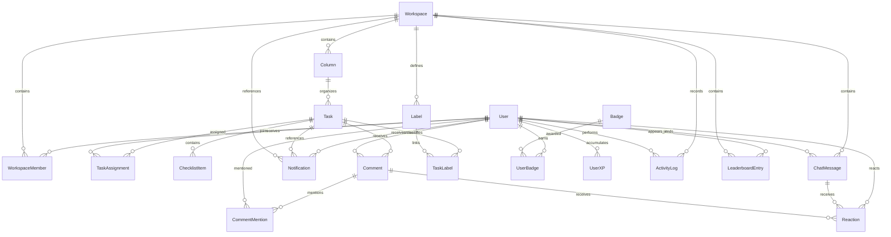

*This project has been created as part of the 42 curriculum by efinda, dnzita, cgama, jbofengo.*

# ft_prodd - Task Manager Kanban

Task management system that combines the visual experience of Notion with the organizational structure of Kanban, specifically developed to meet the needs of 42 School students.

## Quick Start

To start the entire project with a single command:

```bash
./scripts/setup.sh
```

This command will:
- Check if Docker is running
- Create `config/.env` file from `config/.env.example`
- Build all Docker images
- Start all services (frontend, backend, databases)
- Verify the health of all services

## Prerequisites

- **Docker** (version 20.10+)
- **Docker Compose** (version 2.0+)
- **Git**

### OAuth Credentials Configuration

Before running the project for the first time, you need to configure the 42 Intra OAuth credentials:

1. Access: https://profile.intra.42.fr/oauth/applications
2. Create a new OAuth application
3. Configure the callback URL: `http://localhost:3001/api/auth/42/callback`
4. Copy the `Client ID` and `Client Secret`
5. Edit the `config/.env` file and add your credentials:
   ```
   INTRA_42_CLIENT_ID=your_client_id
   INTRA_42_CLIENT_SECRET=your_client_secret
   ```

## Project Architecture

The project uses a simple and efficient **monolithic architecture**:

```
ft_prodd/
├── backend/                   # Unified backend (Express + Socket.IO)
│   ├── src/
│   │   ├── routes/           # API routes
│   │   ├── controllers/      # Control logic
│   │   ├── services/         # Business rules
│   │   ├── models/           # Data models
│   │   ├── middlewares/      # Middlewares (auth, validation)
│   │   ├── config/           # Configurations
│   │   └── utils/            # Utilities
│   └── prisma/               # Database schema
├── frontend/                  # React Application
├── config/                    # Nginx, Database configs
├── scripts/                   # Automation scripts
└── config/docker-compose.yaml # Container orchestration
```

### Services and Ports

| Service | Port | Description |
|---------|-------|-----------|
| Frontend | 3000 | React Interface |
| Backend | 3001 | REST API + WebSocket (Socket.IO) |
| PostgreSQL | 5432 | Main database |
| Redis | 6379 | Cache and sessions |
| Nginx | 80 | Reverse proxy (optional) |

## Available Commands

### Initialization and Setup

```bash
# Complete initial setup
./scripts/setup.sh

# Development mode (with visible logs)
./scripts/dev.sh

# Run database migrations
./scripts/migrate.sh

# Check service health
./scripts/health-check.sh
```

### Container Management

```bash
# Start all services in background
make up
# or
docker compose -f config/docker-compose.yaml --env-file config/.env up -d

# Stop all services
make down
# or
docker compose -f config/docker-compose.yaml --env-file config/.env down

# View logs of a specific service
make logs-backend    # Backend logs
make logs-frontend   # Frontend logs
# or
docker compose -f config/docker-compose.yaml --env-file config/.env logs -f [service-name]

# View status of all containers
make ps
# or
docker compose -f config/docker-compose.yaml --env-file config/.env ps

# Restart all services
make restart
```

### Cleanup and Reset

```bash
# Clean everything (containers, volumes, images)
make clean
# or
./scripts/clean.sh

# Only stop and remove containers
make down

# Complete database reset (LOSES DATA)
make reset-db

# Complete project reset (LOSES EVERYTHING)
make reset-all

# Only stop and remove containers
docker compose -f config/docker-compose.yaml --env-file config/.env down

# Stop and remove volumes (LOSES DATA)
docker compose -f config/docker-compose.yaml --env-file config/.env down -v
```

## Development Structure

### Environment Variables

The `config/.env.example` file contains all necessary variables. Copy it to `config/.env` and configure:

```bash
cp config/.env.example config/.env
```

Main variables you should configure:
- `INTRA_42_CLIENT_ID` - 42 OAuth Client ID
- `INTRA_42_CLIENT_SECRET` - 42 OAuth Client Secret  
- `JWT_SECRET` - Secret key for JWT (minimum 32 characters)
- `JWT_REFRESH_SECRET` - Key for refresh tokens
- `POSTGRES_PASSWORD` - PostgreSQL password
- `REDIS_PASSWORD` - Redis password

### Hot Reload

All services are configured with **hot reload** in development mode:
- Backend: Nodemon detects changes in `.ts` and restarts automatically
- Frontend: Vite HMR (Hot Module Replacement)

## Tests

```bash
# Run backend tests
make test-backend

# Run frontend tests
make test-frontend

# Run all tests
make test-all

# Run tests with coverage
make test-coverage
```

### Health Checks

The backend has a health check endpoint:

- Backend: http://localhost:3001/api/health
- Frontend: http://localhost:3000

Use the verification script:
```bash
make health
# or
./scripts/health-check.sh
```

### Logs

```bash
# View logs of all services
make logs

# View last 100 lines of logs
docker compose -f config/docker-compose.yaml --env-file config/.env logs --tail=100

# View logs of specific services
make logs-backend    # Backend
make logs-frontend   # Frontend
make logs-db         # PostgreSQL
make logs-redis      # Redis

# View logs of specific services
docker compose -f config/docker-compose.yaml --env-file config/.env logs -f backend frontend
```

## Troubleshooting

### Container won't start

```bash
# View logs of problematic container
docker compose -f config/docker-compose.yaml --env-file config/.env logs [service-name]

# Forced rebuild
docker compose -f config/docker-compose.yaml --env-file config/.env build --no-cache [service-name]
docker compose -f config/docker-compose.yaml --env-file config/.env up -d [service-name]
```

### Port already in use

```bash
# Check what is using the port
lsof -i :3000  # or the problematic port
```

### Database problems

```bash
# Complete database reset (LOSES DATA)
make reset-db

# Only run migrations again
make migrate
# or
./scripts/migrate.sh

# Open Prisma Studio to visualize data
make prisma-studio

# Access PostgreSQL shell
make db-shell

# Complete database reset (LOSES DATA)
docker compose -f config/docker-compose.yaml --env-file config/.env down -v
./scripts/setup.sh

# Only run migrations again
./scripts/migrate.sh
```

## Security

- Never commit the `config/.env` file (already in `.gitignore`)
- Change all default passwords in production
- Use HTTPS in production (nginx configuration included)
- Review and update dependencies regularly
- Redis and PostgreSQL with strong passwords
- Rate limiting configured to protect against abuse

## Useful Commands (Summary)

```bash
# Start project
make setup          # First time (complete setup)
make up             # Start services
make dev            # Development mode with logs

# Development
make logs-backend   # View backend logs
make shell-backend  # Access backend shell
make test-backend   # Run tests
make prisma-studio  # GUI to visualize database

# Maintenance
make health         # Check service health
make restart        # Restart everything
make clean          # Clean everything

# Information
make help           # View all commands
make info           # View service URLs
```

## Important URLs

| Service | URL | Description |
|---------|-----|-----------|
| **Frontend** | http://localhost:3000 | User interface |
| **Backend API** | http://localhost:3001 | REST API |
| **Health Check** | http://localhost:3001/api/health | Backend status |
| **PostgreSQL** | localhost:5432 | Database |
| **Redis** | localhost:6379 | Cache and sessions |

---

# Team Information

#### *efinda* - Project Manager & Frontend Developer
  - **Project Management:**
    - Facilitate sprint planning and retrospective sessions.
    - Monitor project timeline and milestone completion.
    - Coordinate team communication and remove obstacles.
    - Identify and mitigate potential project risks.
  - **Frontend Development:**
    - Build user interfaces with React.
    - Create responsive, mobile-friendly layouts.
    - Develop reusable UI components.

#### *dnzita* - Product Owner & Developer
  - **Product Ownership:**
    - Manage and prioritize the feature backlog.
    - Define what gets built and in what order.
    - Review and approve completed deliverables.
    - Serve as primary contact during evaluations.
  - **Development:**
    - Connect frontend and backend systems.
    - Build gamification features and UI.

#### *cgama* - Technical Lead & Developer
  - **Technical Leadership:**
    - Design the overall system architecture.
    - Select frameworks, libraries, and tools.
    - Establish coding standards and practices.
    - Conduct critical code quality reviews.
  - **Development:**
    - Build technically challenging features.
    - Handle complex system integrations.
    - Set up deployment infrastructure.

#### *jbofengo* - Pure Backend Developer
  - **Backend Development:**
    - Develop server-side features and APIs.
    - Review teammates' code for quality.
    - Test backend implementations thoroughly.
    - Maintain clear technical documentation.


# Project Management

### How We Organize Our Work

We follow the **Agile Kanban methodology** to manage our workflow efficiently. Our process works like this:

At the project's start, we break down all required work into small, manageable tasks — what we call "**salami slicing**" the work. These slices are distributed across team members based on their specific roles (PM, PO, Tech Lead, Dev).

**Our bi-weekly meeting rhythm:**

- **Monday @ 12:00 PM - Sprint Planning:** We select task slices from the backlog and distribute them among team members to work on throughout the week. Each member knows exactly what they need to "eat" (complete) before Friday.

- **Friday @ 6:00 PM - Sprint Review:** We check if all the salami slices distributed on Monday were successfully "eaten" (completed). Members demonstrate their completed work, the Product Owner validates functionality, and the Technical Lead reviews code quality.

This cadence keeps everyone accountable and ensures continuous progress without overwhelming any single team member.

### Project Management Tools

We use **Trello** as our Kanban board platform. The board is shared among all team members, providing complete visibility into the project's state.

Our Trello board structure:
- **Backlog** - All upcoming tasks waiting to be picked up
- **To Do** - Tasks assigned for the current sprint
- **In Progress** - Work currently being developed
- **Review** - Completed work awaiting validation
- **Done** - Validated and merged work

Team members move their assigned cards across columns as they progress, giving everyone real-time visibility into what's being worked on, what's blocked, and what's completed.

### Communication Channels

We use a **two-channel communication strategy** to balance urgency and organization:

#### **WhatsApp Group - Quick Communication**
Used for time-sensitive messages and urgent coordination. Since most team members check WhatsApp frequently throughout the day, it's our go-to for:
- Urgent blockers or issues
- Last-minute meeting changes
- Quick yes/no questions
- General team coordination

#### **Slack Workspace - Structured Work Discussion**
Our primary platform for organized, topic-specific communication. The workspace is divided into focused channels:

- **#avisos** - Team-wide announcements and important updates
- **#standup-check-in** - Weekly progress updates (mandatory Wednesday check-in)
- **#frontend** - React, UI/UX, and component discussions
- **#backend** - API, database, and server-side topics
- **#devops** - Docker, deployment, and infrastructure
- **#review** - Features reviews and technical feedback
- **#docs-and-resources** - Documentation, tutorials, and learning materials

This dual-channel approach ensures we never miss urgent issues (WhatsApp) while keeping technical discussions organized and searchable (Slack).


# Technical Stack

The technology stack was carefully selected to maximize the productivity of the 4-person team, minimize the learning curve, and ensure agile development within the 4-month deadline.

## Core Technologies

| Component | Chosen Technology | Technical Justification for Our Case | Estimated Time to Learn Basics (for Beginners) |
|------------|---------------------|------------------------------------------|--------------------------------------------------------|
| **Main Language** | JavaScript (with optional TypeScript) | Everything in the same language avoids learning multiple syntaxes, facilitating collaboration in a team of 4. Integrates frontend/backend effortlessly, supports multi-user and real-time natively. Aligns with the subject (e.g.: React/Express as valid frameworks). Simple for Docker deployment. | 1-2 weeks (if zero JS; if basic, 2-3 days). Focus on variables, functions and async for Node. |
| **Frontend Framework** | React with Vite | React is listed as framework in document (architectural ecosystem), Vite is fast starter (build in seconds vs. hours in others). Easy integration with Socket.IO for real-time (chat/games) and Tailwind for responsive. Earns points in "frontend framework" (1-2 pts). For 4 months, avoids Angular/Vue overhead. | 2-4 weeks (fundamentals: components, state, hooks). 1-2 hour courses accelerate, but practice takes time. |
| **Styling/CSS Solution** | Tailwind CSS | Styling solution recommended in subject (fast for responsive/accessible on devices). Integrates directly into React (inline classes), no separate CSS, saving time in small team. Supports custom design system (minor module, 1 pt). | 1-2 days (basic utility classes). Mental shift from traditional CSS takes 24 hours, but 90 min tutorials suffice. |
| **Backend Framework** | Node.js with Express | Express is listed backend framework, lightweight and minimalist for secure APIs (rate limiting, GET/POST endpoints etc. for public API, 2 pts). Integrates with Socket.IO for real-time and Prisma for DB. For multi-user, handles concurrency without crashes. Simple for 4 months vs. NestJS (more complex). | Node: 1-3 weeks (runtime basics). Express: 3-5 days (routes, middleware). If they know JS, 1 day. |
| **Real-Time/Communication** | Socket.IO | Technology similar to WebSockets listed for real-time features (2 pts) and user interaction (chat, 2 pts). Integrates in 1 line in Express and React, handling disconnections/broadcasts for multiplayer games. Essential for multi-user without polling. | 1-2 hours (basic events: emit/on). 30-80 min courses cover everything. |
| **Database** | PostgreSQL | Relational DB with clear schema/relations (mandatory). Supports multi-user without race conditions, integrates with Prisma for validations. Robust for game stats/user data. Free and scalable for 4 months. | 2-4 weeks (basic queries: SELECT, JOIN). If they know SQL, 1 week. |
| **ORM (Object-Relational Mapping)** | Prisma | Simple ORM minor (1 pt), with auto migrations and type-safety. Integrates with Node/Express in minutes, validates backend inputs (mandatory). Avoids raw SQL for beginner team, facilitating user management. | 1-2 hours (schema, queries). 60 min courses for basics. |
| **Authentication** | JWT with bcrypt | JWT for secure sessions (standard user management, 2 pts; OAuth minor if added). Bcrypt for hashing passwords (salted, mandatory). Integrates with Express in simple middleware, supports future 2FA. Secure for multi-user. | JWT: 15-30 min (generate/validate tokens). Bcrypt: 30 min-1 hour (hash/compare). 4-15 min tutorials. |
| **Containerization/Deployment** | Docker with Docker Compose | Mandatory solution to run single-command. Compose manages multi-containers (frontend/backend/DB) easily, integrates Nginx for HTTPS. For 4 months, avoids manual setups on different machines. | Docker: 1-2 days (images, containers). Compose: 1 day (basic YAML). 15-45 min tutorials + practice. |
| **Reverse Proxy/HTTPS** | Nginx | For HTTPS everywhere (mandatory). Integrates as container in Compose, proxy to Express. Simple config for multi-user/performance. Avoids complex certs. | 1-2 days (basic config: server blocks). 1 hour courses for beginners. |

## Development Tools

- **Version Control:** Git + GitHub
- **Project Management:** Trello (Kanban Board)
- **Communication:** Slack + WhatsApp
- **IDE:** VS Code (recommended)
- **Testing:** Jest (backend), React Testing Library (frontend)
- **Linting:** ESLint + Prettier
- **CI/CD:** GitHub Actions (optional)

## Main Dependencies

### Backend Services
```json
{
  "express": "^4.18.2",
  "socket.io": "^4.6.1",
  "prisma": "^5.7.0",
  "@prisma/client": "^5.7.0",
  "jsonwebtoken": "^9.0.2",
  "bcrypt": "^5.1.1",
  "passport": "^0.6.0",
  "passport-oauth2": "^1.7.0",
  "redis": "^4.6.10",
  "cors": "^2.8.5",
  "helmet": "^7.1.0",
  "express-rate-limit": "^7.1.5"
}
```

### Frontend
```json
{
  "react": "^18.2.0",
  "react-dom": "^18.2.0",
  "vite": "^5.0.0",
  "tailwindcss": "^3.3.0",
  "socket.io-client": "^4.6.1",
  "react-router-dom": "^6.20.0",
  "axios": "^1.6.2"
}
```

## Architectural Decisions

### Why Monolith (instead of Microservices)?
- **Simplicity:** Easier to develop and debug for a team of 4 people
- **Performance:** Less communication overhead between services
- **Rapid Development:** Faster deploy and iteration
- **Less Complexity:** Only 1 backend codebase to manage
- **Facilitates Collaboration:** Team can work on the same repository without integration conflicts

### Why TypeScript (Optional)?
- **Type Safety:** Reduces bugs in production
- **IntelliSense:** Better development experience
- **Living Documentation:** Types serve as documentation
- **Safe Refactoring:** Large changes with confidence

### Why Prisma ORM?
- **Type-Safe Queries:** Native TypeScript
- **Automatic Migrations:** Schema versioning
- **Declarative Schema:** Easy to understand and maintain
- **Built-in Validation:** Reduces boilerplate code

## Compatibility Matrix

| Subject Requirement | Technology Used | Status |
|----------------------|---------------------|--------|
| Frontend Framework | React + Vite | Yes |
| Backend Framework | Express (Node.js) | Yes |
| Database | PostgreSQL | Yes |
| Real-time Features | Socket.IO | Yes |
| User Management | JWT + bcrypt + Passport | Yes |
| Standard Security | Helmet + CORS + Rate Limiting | Yes |
| Docker Deployment | Docker Compose | Yes |
| HTTPS | Nginx Reverse Proxy | Yes |
| Multi-user Support | PostgreSQL + Redis Sessions | Yes |
| Monolithic Architecture | Unified Express | Yes |

# Database Schema

The database uses **PostgreSQL** with **Prisma ORM** and was designed to support Kanban-style task management, workspace collaboration, notifications, chat, and gamification.

## Structure overview

- **User** represents each platform user.
- **Workspace** groups members, columns, labels, messages, and ranking data.
- **Column** organizes tasks inside a workspace.
- **Task** is the central entity in the Kanban workflow.
- Junction tables such as **WorkspaceMember**, **TaskAssignment**, **TaskLabel**, and **UserBadge** handle many-to-many relationships.
- Supporting entities such as **Comment**, **Notification**, **Reaction**, **ActivityLog**, **UserXP**, and **LeaderboardEntry** enable collaboration and gamification features.

## Visual representation



## Tables and relationships

### Identity and collaboration core

| Table | Purpose | Key fields | Relationships |
|--------|---------|------------|---------------|
| `User` | Stores application users | `id: Int`, `nickname: String`, `email: String`, `passwordHash: String`, `avatarUrl: String`, `createdAt: DateTime` | 1:N with `WorkspaceMember`, `TaskAssignment`, `Notification`, `Comment`, `Reaction`, `ChatMessage`, `ActivityLog`, `LeaderboardEntry`; 1:N with `UserBadge` and `UserXP` |
| `Workspace` | Represents each workspace | `id: Int`, `name: String`, `description: String`, `createdAt: DateTime` | 1:N with `WorkspaceMember`, `Column`, `Notification`, `ActivityLog`, `ChatMessage`, `Label`, `LeaderboardEntry` |
| `WorkspaceMember` | Links users to workspaces with permissions | `id: Int`, `workspaceId: Int`, `userId: Int`, `role: WorkspaceRole` | N:1 with `User`; N:1 with `Workspace` |

### Kanban structure

| Table | Purpose | Key fields | Relationships |
|--------|---------|------------|---------------|
| `Column` | Columns in the Kanban board | `id: Int`, `workspaceId: Int`, `name: String`, `order: Int` | N:1 with `Workspace`; 1:N with `Task` |
| `Task` | Main task entity in the system | `id: Int`, `columnId: Int`, `title: String`, `description: String`, `orderInColumn: Int` | N:1 with `Column`; 1:N with `TaskAssignment`, `ChecklistItem`, `Notification`, `Comment`, `TaskLabel` |
| `TaskAssignment` | Assigns tasks to users | `id: Int`, `taskId: Int`, `userId: Int` | N:1 with `Task`; N:1 with `User` |
| `ChecklistItem` | Checklist items belonging to a task | `id: Int`, `taskId: Int`, `text: String`, `isCompleted: Boolean` | N:1 with `Task` |
| `Label` | Reusable labels within a workspace | `id: Int`, `workspaceId: Int`, `name: String`, `color: String` | N:1 with `Workspace`; 1:N with `TaskLabel` |
| `TaskLabel` | Junction between tasks and labels | `id: Int`, `taskId: Int`, `labelId: Int` | N:1 with `Task`; N:1 with `Label` |

### Communication and activity

| Table | Purpose | Key fields | Relationships |
|--------|---------|------------|---------------|
| `Comment` | Comments attached to tasks | `id: Int`, `taskId: Int`, `authorId: Int`, `content: String` | N:1 with `Task`; N:1 with `User`; 1:N with `CommentMention` and `Reaction` |
| `CommentMention` | Stores user mentions inside comments | `id: Int`, `commentId: Int`, `userId: Int` | N:1 with `Comment`; N:1 with `User` |
| `Notification` | System notifications | `id: Int`, `userId: Int`, `message: String`, `type: NotificationType`, `isRead: Boolean`, `relatedTaskId: Int?`, `relatedWorkspaceId: Int?` | N:1 with `User`; optional N:1 with `Task`; optional N:1 with `Workspace` |
| `ChatMessage` | Internal workspace chat messages | `id: Int`, `workspaceId: Int`, `senderId: Int`, `content: String` | N:1 with `Workspace`; N:1 with `User`; 1:N with `Reaction` |
| `Reaction` | Emoji reactions on messages or comments | `id: Int`, `emoji: String`, `userId: Int`, `messageId: Int?`, `commentId: Int?` | N:1 with `User`; optional N:1 with `ChatMessage`; optional N:1 with `Comment` |
| `ActivityLog` | History of actions within a workspace | `id: Int`, `workspaceId: Int`, `userId: Int`, `action: String` | N:1 with `Workspace`; N:1 with `User` |

### Gamification

| Table | Purpose | Key fields | Relationships |
|--------|---------|------------|---------------|
| `Badge` | Badge catalog | `id: Int`, `name: String`, `description: String`, `iconUrl: String` | 1:N with `UserBadge` |
| `UserBadge` | Badges earned by users | `id: Int`, `userId: Int`, `badgeId: Int` | N:1 with `User`; N:1 with `Badge` |
| `UserXP` | Experience points per user | `id: Int`, `userId: Int`, `xp: Int` | N:1 with `User` |
| `LeaderboardEntry` | Weekly ranking by workspace | `id: Int`, `userId: Int`, `workspaceId: Int`, `xpWeek: Int`, `rank: Int`, `weekYear: String` | N:1 with `User`; N:1 with `Workspace` |

## Main data types

- **`Int`**: identifiers, ordering, ranking, and XP values.
- **`String`**: names, descriptions, text content, URLs, colors, and log actions.
- **`Boolean`**: binary states such as `isCompleted` and `isRead`.
- **`DateTime`**: timestamp auditing with `createdAt` and `updatedAt` in almost every table.
- **Enums**:
  - `WorkspaceRole`: `admin`, `member`, `guest`
  - `NotificationType`: `mention`, `taskAssignment`, `comment`, `invite`

## Important modeling rules

- All main entities use an auto-increment `id` as the primary key.
- `nickname` and `email` in `User` are unique.
- The schema favors explicit relationships to simplify Prisma queries.
- The fields `relatedTaskId`, `relatedWorkspaceId`, `messageId`, and `commentId` are optional so notifications and reactions can support different contexts.
- Separate junction tables help scale permissions, assignments, and gamification without data duplication.

# Features List


# Modules


# Individual Contributions
