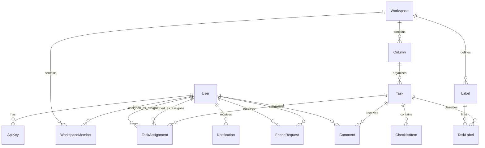

*This project has been created as part of the 42 curriculum by efinda, dnzita, cgama, jbofengo.*

# Description

**ft_prodd(...)** is a full-stack web application designed to improve how developers collaborate on group projects, with a strong focus on the workflow commonly experienced by **42 students**.

The name reflects both its purpose and its roots: the `ft_` prefix follows the traditional naming convention used across 42 projects, *prod* comes from *productivity*, and the trailing `d` references Unix daemons — symbolizing a system that continuously runs in the background, tracking progress and activity. The `(...)` notation is inspired by function syntax, reinforcing the project’s programming-oriented identity.

The main goal of **ft_prodd(...)** is to provide a centralized platform where users can **organize, track, and improve their project workflow**, reducing common issues such as poor coordination, lack of visibility, and last-minute surprises during evaluation.

While the platform is inspired by and tailored to the needs of 42 students, **it is open to any user** who wants to manage collaborative projects in a structured and efficient way.

The application combines task management, collaboration tools, and real-time features into a single environment. It allows multiple users to interact simultaneously, manage shared workspaces, and monitor project progress as it evolves.

## Key Features

- **Authentication & User Management**
  JWT-based sessions, OAuth 2.0 login via the 42 API, user profiles with avatars, a friendship system, and role-based permissions (admin, member, guest) within workspaces.

- **Workspace & Task Management**
  Collaborative workspaces with Kanban boards, columns, tasks, checklists, labels, and member assignments for full project visibility.

- **Communication & Real-Time**
  Live updates via WebSocket (Socket.IO), presence status, and task comments with mentions.

- **Notifications & Advanced Search**
  Real-time notifications for all creation, update, and deletion events, with advanced filtering, sorting, and pagination.

- **System & Infrastructure**
  Public RESTful API with key authentication, rate limiting, and Swagger documentation; Docker containerization; Prisma ORM; and a custom React design system.


# Instructions

This section explains how to **set up, configure, and run** the project locally.

The project is fully containerized using **Docker** and managed through a **Makefile**, which provides a simplified interface for all commands.

---

## Prerequisites

Before running the project, make sure you have the following installed:

* **Docker**
* **Docker Compose**
* **Make**
* **OpenSSL** (used to generate TLS certificates for HTTPS)

> All services run inside containers, so no manual installation of Node.js, PostgreSQL, or other dependencies is required on the host machine.

---

## Project Setup

Clone the repository and navigate to the project root:

```bash
git clone <repository_url>
cd ft_prodd
```

---

## Environment Configuration

The project uses environment variables for configuration, and since the `.env` file is ignored by Git, it will not be present when cloning the repository.

A `.env.example` file located inside `config/` is provided as a **template**, containing all the required environment variable names. The values in this file are placeholders and must be configured before running the project.

---

## Running the Project

### Initial Setup (one-time)

```bash
make setup
```

This single command will:

1. Generate **TLS certificates** for local HTTPS
2. Check if Docker is running
3. Create `.env` from `.env.example` if none exists, then **pause** and wait for you to configure it
4. Stop any existing containers
5. Build all Docker images
6. Start all containers
7. Verify service health

> After `make setup` completes, the application is already running.

---

### Common Commands

```bash
make up      # Start all services
make down    # Stop all services
make restart # Restart all services
make logs    # Follow logs of all services
make ps      # Show container status
make info    # Show service URLs and access info
```

---

### Rebuilding Services

```bash
make rebuild          # Rebuild all services from scratch
make rebuild-backend  # Rebuild only the backend
make rebuild-frontend # Rebuild only the frontend
```

---

### Database

```bash
make prisma-studio  # Open Prisma Studio (GUI for the database)
```

---

### Maintenance

```bash
make clean      # Remove all containers, volumes, and images
make reset-all  # Full clean + fresh setup (wipes everything)
```

---

## Notes

* The project is designed to run with a **single command** (`make setup`) as required by the subject.
* All services run inside Docker containers.
* The Makefile abstracts Docker commands to provide a simpler and consistent workflow.


# Resources

In this section, you have access to the main resources that helped us develop this project:

## Team Organization and Project Management

- [Project Manager vc Product Owner](https://youtu.be/2DwP_3gBGeQ?si=LaIiU4pE2RX_cpnD) — Youtube

- [Product Manager vs Project Manager - Project Management Training](https://youtu.be/WGvj_I2L020?si=HpxTi7Bkj9ocWPpb) — Youtube

- [Product Owner or Tech Lead, Not Both](https://chris-hand.medium.com/product-owner-lead-engineer-absolute-power-c00323c96b66) — Medium

- [Scrum vs Kanban - What's the Difference?](https://youtu.be/rIaz-l1Kf8w?si=qtOJpXPLZoCcXz0h) — Youtube

- [Basics of Kanban Boards for Project Management with Ricardo Vargas](https://youtu.be/XpK1vXM5Dd0?si=2e1jMqJp8zzNrkUs) — Youtube

- [What is a sprint (software development)?](https://www.techtarget.com/searchsoftwarequality/definition/Scrum-sprint) — TechTarget

- [Trello Tutorial in Ten Minutes (How to Use Trello to Get Your Life Together)](https://youtu.be/en3z928rwus?si=SJI1De0LO2RZApAj) — Youtube


## Frontend

- [How browsers work](https://web.dev/articles/howbrowserswork) — web.dev

- [The State of State Management in React (useState, Context API, Zustand...)](https://www.youtube.com/watch?v=qqqyUTTS-9g) — Youtube

- [React Query Crash Course - Learn Queries, Mutations, Caching, Optimistic Updates...](https://www.youtube.com/watch?v=e74rB-14-m8) — Youtube

- [React State Management in 2025: What You Actually Need](https://www.developerway.com/posts/react-state-management-2025) — developerway

- [Quickstart Guide](https://dndkit.com/quickstart/) — dndkit

- [Graph vs Chart: What's the Difference?](https://blacklabel.net/blog/data-visualization/chart-types/graph-vs-chart-whats-the-difference/) — blacklabel.net

### AI Usage

- **State Management:** AI helped identify the problem of prop drilling in React and recommended appropriate state management tools, guiding the decision to avoid unnecessary complexity while keeping the component tree clean and maintainable.

- **Figma Page Layouts:** AI assisted in designing and structuring the Figma page layouts, helping to plan the UI hierarchy and component placement before implementation.

- **Architecture & Integration:** AI served as a technical partner for discussing frontend architecture, including the use of Axios interceptors for API communication, and helped debug issues during development.


## Backend

- [CI/CD Explained: The DevOps Skill That Makes You 10x More Valuable](https://www.youtube.com/watch?v=AknbizcLq4w) — Youtube

- [Teste de integração no Node com Jest e SuperTest](https://www.youtube.com/watch?v=L9rHlPtNi3g) — Youtube

- [Criando testes na aplicação com Jest e SuperTest - Code/drops #93](https://www.youtube.com/watch?v=18Dgf7lb9QA) — Youtube

- [Crypto module](https://nodejs.org/api/crypto.html#cryptorandombytessize-callback) — nodejs.org

### AI Usage

- **Public API:** it helped to design and implement the API with code snippets for secure key authentication (creation and storage) and rate limiting in Express, together with a comprehensive documentation.

- **OAuth 2.0:** it helped implement the OAuth 2.0 authentication flow, including user redirection to the 42 authorization page, callback handling, authorization code exchange, access token retrieval, and user information fetching from the 42 API.

- **WebSocket (Socket.IO):** it helped implement and design the real-time features using Socket.IO, including event handling for task comments, notifications, and user presence updates, user connection management, and broadcasting events to relevant users in workspaces.

- **SignIn and SignUp:** it helped implement the authentication system, including password hashing with bcrypt, JWT-based session authentication, request parsing and validation, TypeScript typing, and schema validation with Zod. It also helped structure the backend into routes, controllers, and middleware to improve maintainability and scalability.

## Database

- [Aprenda em 13:37: Prisma](https://www.youtube.com/watch?v=uApCW1gcpdE&t=16s) — Youtube

### AI Usage

- **Schema Evolution:** AI helped design and evolve the Prisma schema throughout the project, guiding the creation of new tables and removal of old ones as requirements changed during development.

- **@@unique() Constraints:** AI introduced the use of `@@unique()` composite uniqueness constraints in the Prisma schema, which were extensively used in controllers to efficiently retrieve data from the database.

- **Database Transactions:** AI explained the concept of database transactions and their importance in multi-user applications, helping to implement safe, atomic operations that prevent data inconsistency in concurrent scenarios.


# Team Information

This section outlines the roles and core responsibilities of each team member within the project.

---

## *efinda* — Project Manager & Developer

* Oversees project planning, coordination, and progress tracking
* Ensures team communication and alignment
* Contributes to both frontend and backend development

---

## *dnzita* — Product Owner & Developer

* Defines product vision and feature priorities
* Manages and validates the project backlog
* Contributes to both frontend and backend development

---

## *cgama* — Technical Lead & Backend Developer

* Designs system architecture and technical decisions
* Defines development standards and best practices
* Leads backend development and infrastructure setup

---

## *jbofengo* — Backend Developer

* Implements backend features and APIs
* Ensures code quality and reliability on the server side
* Supports testing and backend maintenance

---


# Project Management

## How We Organize Our Work

We follow the **Agile Kanban methodology** to manage our workflow efficiently. Our process works like this:

At the project's start, we break down all required work into small, manageable tasks — what we call "**salami slicing**" the work. These slices are distributed across team members based on their specific roles (PM, PO, Tech Lead, Dev).

**Our bi-weekly meeting rhythm:**

- **Monday @ 12:00 PM - Sprint Planning:** We select task slices from the backlog and distribute them among team members to work on throughout the week. Each member knows exactly what they need to "eat" (complete) before Friday.

- **Friday @ 6:00 PM - Sprint Review:** We check if all the salami slices distributed on Monday were successfully "eaten" (completed). Members demonstrate their completed work, the Product Owner validates functionality, and the Technical Lead reviews code quality.

This cadence keeps everyone accountable and ensures continuous progress without overwhelming any single team member.

## Project Management Tools

We use **Trello** as our Kanban board platform. The board is shared among all team members, providing complete visibility into the project's state.

Our Trello board structure:
- **Backlog** - All upcoming tasks waiting to be picked up
- **To Do** - Tasks assigned for the current sprint
- **Doing** - Work currently being developed
- **Blocked** - Tasks put on hold due to dependencies missing
- **Review** - Completed work awaiting validation
- **Done** - Validated and merged work
- **Modules** - Checklist of the modules

Team members move their assigned cards across columns as they progress, giving everyone real-time visibility into what's being worked on, what's blocked, and what's completed.

## Communication Channels

We use a **two-channel communication strategy** to balance urgency and organization:

### **WhatsApp Group - Quick Communication**
Used for time-sensitive messages and urgent coordination. Since most team members check WhatsApp frequently throughout the day, it's our go-to for:
- Urgent blockers or issues
- Last-minute meeting changes
- Quick yes/no questions
- General team coordination

### **Slack Workspace - Structured Work Discussion**
Our primary platform for organized, topic-specific communication. The workspace is divided into focused channels:

- **#avisos** - Team-wide announcements and important updates
- **#standup-check-in** - Weekly progress updates (mandatory Wednesday check-in)
- **#frontend** - React, UI/UX, and component discussions
- **#backend** - API, database, and server-side topics
- **#devops** - Docker, deployment, and infrastructure
- **#review** - Features reviews and technical feedback
- **#docs-and-resources** - Documentation, tutorials, and learning materials

This dual-channel approach ensures we never miss urgent issues (WhatsApp) while keeping technical discussions organized and searchable (Slack).


# Technical Stack

The technology stack was selected to ensure efficient development within a 4-person team, while meeting all subject requirements and supporting a scalable, real-time, multi-user application.

---

## Frontend

* **Framework:** React (with Vite)
* **Styling:** Tailwind CSS

React provides a component-based architecture suitable for building dynamic user interfaces, while Vite ensures fast development and build performance. Tailwind CSS enables rapid UI development with a consistent and maintainable design system.

---

## Backend

* **Runtime & Framework:** Node.js with Express

Express is a lightweight and flexible backend framework used to build RESTful APIs. It integrates easily with real-time communication layers and middleware for authentication, security, and request handling.

---

## Database

* **System:** PostgreSQL

PostgreSQL was chosen for its reliability, strong consistency, and support for relational data models. It is well-suited for multi-user environments and complex queries, ensuring data integrity across the application.

---

## Additional Technologies

| Technology               | Layer                | Purpose                              |
| ------------------------ | -------------------- | ------------------------------------ |
| **TypeScript**           | Frontend / Backend   | Programming language                 |
| **React Router**         | Frontend             | Client-side routing                  |
| **TanStack React Query** | Frontend             | Server state management              |
| **dnd-kit**              | Frontend             | Drag-and-drop interactions           |
| **Axios**                | Frontend             | HTTP client                          |
| **Lucide React**         | Frontend             | Icon library                         |
| **Prisma**               | Backend              | ORM and database migrations          |
| **Socket.IO**            | Frontend / Backend   | Real-time communication              |
| **JWT + bcrypt**         | Backend              | Session authentication               |
| **Multer**               | Backend              | File upload handling                 |
| **Helmet**               | Backend              | Security HTTP headers                |
| **Zod**                  | Frontend / Backend   | Schema validation                    |
| **Swagger**              | Backend              | API documentation                    |
| **Jest**                 | Backend              | Testing framework                    |
| **Docker + Compose**     | Infrastructure       | Containerization                     |
| **Nginx**                | Infrastructure       | Reverse proxy and HTTPS termination  |


# Database Schema

The application uses **PostgreSQL** with **Prisma ORM**.
The schema is designed to support task management, workspace collaboration, user interaction, and public API features.

---

## Structure Overview

The database is organized around the following core concepts:

* **User**: Represents each platform user, with authentication, avatar, XP, and API key tracking
* **Workspace**: Groups users, tasks, and collaborative data into shared environments
* **Column**: Defines task organization within a workspace (Kanban stages)
* **Task**: Central work item with priority, due dates, and assignment support

Additional tables handle relationships, social features, notifications, and API key management.

---

## Visual Representation



---

## Tables and Relationships

### Core Entities

| Table             | Description                                     | Key Fields                                                        |
| ----------------- | ----------------------------------------------- | ----------------------------------------------------------------- |
| `User`            | Platform users                                  | `id`, `username`, `email`, `passwordHash`, `avatarUrl`, `totalXp`, `fortyTwoId`, `apiKeyCount` |
| `ApiKey`          | API keys for public API access                  | `id`, `keyHash`, `name`, `userId`                                 |
| `Workspace`       | Collaborative workspace                         | `id`, `name`, `description`, `totalTask`                          |
| `WorkspaceMember` | Links users to workspaces with roles            | `id`, `workspaceId`, `userId`, `role` - *@@unique([workspaceId, userId])* |
| `FriendRequest`   | Friendship requests between users               | `id`, `senderId`, `receiverId`, `status` - *@@unique([senderId, receiverId])* |

---

### Task Management (Kanban)

| Table            | Description                      | Key Fields                                                      |
| ---------------- | -------------------------------- | --------------------------------------------------------------- |
| `Column`         | Task grouping inside a workspace | `id`, `workspaceId`, `name`, `columnType`, `order`              |
| `Task`           | Main task entity                 | `id`, `columnId`, `creatorId`, `title`, `description`, `priority`, `dueDate`, `isDone`, `orderInColumn` |
| `TaskAssignment` | Assigns tasks to users           | `id`, `taskId`, `userId`, `assignedById` - *@@unique([taskId, userId])* |
| `ChecklistItem`  | Task checklist items             | `id`, `taskId`, `description`, `isCompleted`                    |
| `Label`          | Reusable labels                  | `id`, `workspaceId`, `name`, `color` (enum)                     |
| `TaskLabel`      | Task-label relationship          | `id`, `taskId`, `labelId` - *@@unique([taskId, labelId])*       |

---

### Social & Notifications

| Table          | Description               | Key Fields                                   |
| -------------- | ------------------------- | -------------------------------------------- |
| `Comment`      | Task comments             | `id`, `taskId`, `authorId`, `content`        |
| `Notification` | System notifications      | `id`, `userId`, `message`, `type`, `isRead`  |

---

## Data Types

The schema uses the following main data types:

* **Int**: identifiers, ordering, XP values, foreign keys
* **String**: names, descriptions, content, URLs, hashed values
* **Boolean**: state flags (e.g., `isDone`, `isRead`, `isCompleted`)
* **DateTime**: timestamps for creation and updates
* **DateTime?**: optional fields (e.g., `dueDate`, `dateCompleted`)
* **Int?**: optional fields (e.g., `fortyTwoId`)

### Enums

* `WorkspaceRole`: `admin`, `member`, `guest`
* `NotificationType`: `friendship`, `workspace`, `task`, `mention`, `comment`, `invite`
* `FriendRequestStatus`: `pending`, `accepted`
* `Priority`: `LOW`, `MEDIUM`, `HIGH`
* `ColumnType`: `backlog`, `todo`, `in_progress`, `code_review`, `done`, `custom`
* `LabelColor`: `red`, `orange`, `yellow`, `green`, `blue`, `purple`, `pink`, `cyan`, `teal`, `indigo`, `lime`, `gray`, `brown`

---

## Modeling Rules

* All entities use an auto-increment `id` as the primary key
* `email` in `User` is unique; `fortyTwoId` in `User` is optionally unique
* Composite unique constraints (`@@unique`) are used to enforce business rules (e.g., one membership per user per workspace, one assignment per task per user)
* Many-to-many relationships are handled through junction tables (e.g., `TaskLabel`, `TaskAssignment`)
* Foreign key constraints use `onDelete: Cascade` for referential integrity
* Optional fields (`?`) are used for nullable data (e.g., `dueDate`, `fortyTwoId`)


# Features List

This section lists all implemented features of the project, along with their description and responsible team members.

---

## Authentication & User Management

| Feature                         | Description                                                                                                             | Implemented By                        |
| ------------------------------- | ----------------------------------------------------------------------------------------------------------------------- | ------------------------------------- |
| **User Authentication**         | Register, log in, and authenticate using JWT-based sessions and password hashing (bcrypt).                               | efinda (Frontend), jbofengo (Backend) |
| **OAuth 2.0 Authentication**    | Log in using 42 API credentials via the OAuth 2.0 authorization flow.                                                   | efinda (Frontend), jbofengo (Backend) |
| **User Profiles**               | Profile management with personal information, avatar upload, and default avatar assignment at signup.                     | efinda                                |
| **Friendship System**           | Send, accept, and remove friend requests; view friends list and their online status on each profile.                     | efinda                                |
| **Social Discovery**            | Browse workspaces your friends are members of to discover and request to join collaborative projects.                     | efinda (Backend), dnzita (Frontend) |
| **Advanced Permissions System** | Role-based access control (admin, member, guest) with role-specific views and actions within workspaces.                | efinda, cgama (Backend), dnzita (Frontend) |

---

## Workspace & Task Management

| Feature                    | Description                                                                                         | Implemented By                        |
| -------------------------- | --------------------------------------------------------------------------------------------------- | ------------------------------------- |
| **Workspace Management**   | Create, update, delete, and browse collaborative workspaces with membership management.              | efinda, cgama (Backend), dnzita (Frontend) |
| **Kanban Board**           | Visual task organization using columns to represent workflow stages within each workspace.           | efinda (Backend), dnzita (Frontend) |
| **Task CRUD**              | Create, update, delete, and reorder tasks across columns.                                           | efinda (Backend), dnzita (Frontend) |
| **Task Assignment**        | Assign tasks to one or multiple workspace members.                                                   | efinda (Backend), dnzita (Frontend) |
| **Task Checklist**         | Add checklist items to tasks and track their completion status.                                     | efinda (Backend), dnzita (Frontend) |
| **Task Labels**            | Categorize tasks using color-coded labels for better organization.                                  | efinda (Backend), dnzita (Frontend) |

---

## Communication & Real-Time

| Feature                              | Description                                                                                    | Implemented By                        |
| ------------------------------------ | ---------------------------------------------------------------------------------------------- | ------------------------------------- |
| **Real-Time WebSocket Infrastructure** | Persistent Socket.IO connections enabling live updates across the platform.                    | cgama (Frontend), jbofengo (Backend) |
| **Real-Time Collaborative Features**    | Live synchronization of task comments for all connected users.              | efinda, jbofengo (Backend), dnzita (Frontend) |
| **Presence System**                  | View online/offline status of friends in real time.                                            | dnzita (Frontend), jbofengo (Backend) |
| **Task Comments & Mentions**         | Comment on tasks with @mentions to notify other workspace members.                             | efinda (Backend), dnzita (Frontend)   |

---

## Notifications

| Feature                   | Description                                                                                                 | Implemented By                        |
| ------------------------- | ----------------------------------------------------------------------------------------------------------- | ------------------------------------- |
| **Notification System**   | Real-time notifications delivered via Socket.IO for all creation, update, and deletion events.               | efinda (Backend), cgama (Frontend)   |
| **Advanced Search**       | Filter, sort, and paginate notifications by type (mentions, task, workspace, friendship), date, and status. | efinda (Backend), dnzita (Frontend)   |

---

## System & Infrastructure

| Feature                    | Description                                                                       | Implemented By         |
| -------------------------- | --------------------------------------------------------------------------------- | ---------------------- |
| **Public API**             | RESTful API secured with API key authentication, rate limiting, and Swagger documentation. | dnzita (Frontend), jbofengo (Backend) |
| **Dockerized Environment** | Full application runs in containers with a single command.                        | cgama, efinda          |
| **ORM Integration**        | PostgreSQL database managed through Prisma ORM with type-safe queries and migrations. | dnzita                 |
| **Secure API**             | Backend secured with middleware (JWT, CORS, Helmet, rate limiting).               | jbofengo               |
| **Custom Design System**   | Consistent UI built with reusable React components, color palette, typography rules, and shared icons. | efinda, dnzita |


# Modules

This section lists all selected modules for the project, including their type, point value, implementation details, and responsible team members.

---

## Modules Overview

| Category                   | Module                                                                                                                    | Type                | Points |
| -------------------------- | ------------------------------------------------------------------------------------------------------------------------- | ------------------- | ------ |
| Web                        | Use a framework for both the frontend and backend                                                                         | Major               | 2      |
|                            | Implement real-time features using WebSockets or similar technology                                                       | Major               | 2      |
|                            | Allow users to interact with other users                                                                                  | Major               | 2      |
|                            | A public API to interact with the database with a secured API key, rate limiting, documentation, and at least 5 endpoints | Major               | 2      |
|                            | Use an ORM for the database                                                                                               | Minor               | 1      |
|                            | A complete notification system for all creation, update, and deletion actions                                             | Minor               | 1      |
|                            | Real-time collaborative features                                                                                          | Minor               | 1      |
|                            | Custom-made design system with reusable components, including a proper color palette, typography, and icons               | Minor               | 1      |
|                            | Implement advanced search functionality with filters, sorting, and pagination                                             | Minor               | 1      |
| User Management            | Standard user management and authentication                                                                               | Major               | 2      |
|                            | Implement remote authentication with OAuth 2.0                                                                            | Minor               | 1      |
|                            | Advanced permissions system                                                                                               | Major               | 2      |
|                            | An organization system                                                                                                    | Major               | 2      |
| **Total**                  | 13                                                                                                                        | 7 Maj. / 6 Min.     | 20     |

---

## Module Details

### Use a framework for both the frontend and backend

* **Justification:**
  Using frameworks for both frontend and backend accelerates development by providing structured architectures, reusable components, and built-in solutions for common problems. This allows the team to focus on implementing features rather than low-level setup.

* **Implementation:**
  The project uses:

  * **React (with Vite)** for the frontend, implementing a component-based architecture to build dynamic user interfaces
  * **Express (Node.js)** for the backend, providing a structured API with routing, middleware, and request handling

  The frontend communicates with the backend through HTTP APIs and real-time communication (Socket.IO), forming a complete client-server architecture.

* **Team:**

  * dnzita, efinda (Frontend)
  * jbofengo, efinda, cgama (Backend)

---

### Implement Real-Time Features Using WebSockets or Similar Technology

* **Justification:**
  Real-time communication enhances collaboration by allowing users to receive updates instantly without manually refreshing the application. This creates a more interactive and responsive experience, particularly in a collaborative task management platform where multiple users may be working simultaneously.

* **Implementation:**
  The project implements real-time communication using **Socket.IO**, enabling the server to push updates directly to connected clients.

  * **Presence System:** Users can view the online or offline status of their friends in real time.

  * **Task Comments:** Comments added to workspace tasks are immediately displayed to all connected users without requiring a page refresh.

  * **Notifications:** User notifications are delivered and updated instantly in the browser, ensuring that important events are communicated as they occur.

  By relying on persistent connections rather than periodic polling, the application provides a more efficient and responsive collaborative experience.

* **Team:**

  * dnzita, cgama (Frontend)
  * jbofengo (Backend)

---

### Allow Users to Interact with Other Users

* **Justification:**
  Enabling user interaction is a core requirement for collaborative platforms, as it allows users to communicate, share information, and build connections within the application. This improves engagement and supports teamwork within and across workspaces.

* **Implementation:**

  The project implements full user interaction capabilities, covering chat, profile, and friends systems.

  * **Basic Chat System:** A real-time messaging system allows users to send and receive direct messages within the workspace task comments, where they can mention other workspace users about updates on the task. These comments are delivered instantly using **Socket.IO**, ensuring real-time communication between connected users.

  * **Profile System:** Each user has a dedicated profile page displaying their information, including username, avatar, and social relationships.

  * **Friends System:** Users can send, accept, and remove friend requests. The friends list is visible on each user profile, and online status is displayed when applicable.

* **Team:**

  * Profile & Friends System: efinda (Frontend + Backend)
  * Basic Chat System: efinda (Backend), dnzita (Frontend)

---

### A Public API to Interact with the Database with a Secured API Key, Rate Limiting, Documentation, and at Least 5 Endpoints

* **Justification:**
  Providing a public API allows external applications to interact with the database securely. API key authentication and rate limiting ensure controlled access and prevent abuse, while proper documentation simplifies integration for third-party developers.

* **Implementation:**
  The backend exposes a RESTful API for workspace management, including **create**, **list**, **retrieve**, **update**, and **delete** operations.

  * **API Key Authentication:** Access is protected through user-generated API keys obtained after authentication. Keys are securely stored as **bcrypt hashes**, displayed only once upon creation, and can be revoked or regenerated by the user.

  * **Rate Limiting:** Requests are limited using the *express-rate-limit* middleware, with separate quotas for read and write operations. When the limit is exceeded, the API responds with **HTTP 429 (Too Many Requests)**.

  * **Documentation:** The API is documented using Swagger, providing interactive documentation and usage examples.

* **Team:**

  * dnzita (Frontend)
  * jbofengo (Backend)

---

### Use an ORM for the Database

* **Justification:**
  Using an ORM simplifies database interaction by abstracting raw SQL queries into a structured and type-safe API. This reduces the risk of errors, improves code maintainability, and allows faster development, especially in a team environment.

* **Implementation:**
  The project uses **Prisma ORM** to define the database schema and handle all database operations.

  * The schema is declared using Prisma’s declarative syntax
  * Migrations are managed through Prisma to keep the database structure consistent
  * All database queries (CRUD operations) are performed through Prisma Client, ensuring type safety and validation

* **Team:** dnzita

---

### A Complete Notification System for All Creation, Update, and Deletion Actions

* **Justification:**
  A notification system improves user awareness by providing real-time updates about important changes in the application.

* **Implementation:**

  The project implements a notification system that tracks creation, update, and deletion events across the platform, including tasks, workspaces, and comments.

  Notifications are generated on the backend and delivered in real time using **Socket.IO**.

  On the frontend, users can view and track notifications in a dedicated interface, with updates appearing instantly without page refresh.

* **Team:**
  * efinda (Backend)
  * dnzita (Frontend)

---

### Real-time Collaborative Features

* **Justification:**
  Real-time collaboration enables multiple users to work simultaneously within shared environments, improving coordination and responsiveness in a team-based application.

* **Implementation:**

  The project implements real-time collaborative features within shared workspaces.

  Shared workspaces allow multiple users to collaborate on tasks simultaneously. Real-time updates are applied to task comments, ensuring that any change is immediately reflected for all connected users.

  This is achieved using **Socket.IO**, enabling live synchronization of comments without requiring page refresh.

  The system focuses on live collaboration within workspace task discussions, providing a responsive and synchronized editing experience.

* **Team:**
  * efinda, cgama (Backend)
  * dnzita (Frontend)

---

### Custom-made Design System with Reusable Components

* **Justification:**
  A custom design system ensures visual consistency across the application and improves development efficiency by promoting reusable UI components.

* **Implementation:**

  The project implements a custom design system on the frontend using **React reusable components**.

  It includes:
    * A consistent color palette applied across all pages (cyan accent, slate neutrals, semantic priority colors)
    * A three-tier typography system: **Manrope** (display and headings), **Inter** (body text), and **JetBrains Mono** (labels, metadata, and code)
    * A shared icon system using **Lucide React** throughout the application
    * A library of reusable components (10+):

      * **Logo** — application logo linking to home, reused across auth, landing, terms, and privacy pages
      * **PasswordInput** — password field with show/hide toggle, reused in sign-in and sign-up forms
      * **ProfileAvatar** — user avatar with gradient fallback and initials, reused across profile pages
      * **StatsRow** — three-column stats grid (tasks completed, tasks assigned, friends), reused in own and other user profiles
      * **FriendAvatar** — friend avatar with online/offline status indicator, reused in friend list components
      * **NotificationsDropdown** — dropdown panel with mark-read functionality
      * **SideBar** — main application sidebar with navigation, workspace list, and notifications bell
      * **WorkspaceCard** — clickable card displaying workspace name, description, member count, and role badge
      * **FeatureCard** — landing page card with icon, title, and description
      * **StepCard** — horizontal card displaying numbered steps for the "how it works" section
      * **Badge** — cyan pill badge for feature labels

    * A shared **modal pattern** (consistent overlay, rounded corners, shadow, close button, and footer actions) reused across `CreateTaskModal`, `CreateColumnModal`, `ApiKeyManagerModal`, `ManageLabelsModal`, and `TaskDetailPanel`

  These components are reused across multiple pages of the application, ensuring a consistent user interface and reducing duplication of code.

* **Team:**
  - efinda, dnzita (Frontend)

---

### Implement Advanced Search Functionality with Filters, Sorting, and Pagination

* **Justification:**
  Advanced search functionality improves usability by allowing users to efficiently locate relevant information within large datasets. Combining filtering, sorting, and pagination provides a scalable and user-friendly way to browse notifications while reducing unnecessary data transfer between the backend and frontend.

* **Implementation:**
  The notification system implements advanced search capabilities through backend query parameters and frontend controls.

  * **Filtering** is supported by allowing users to retrieve notifications by their type (e.g., mentions, task, workspaces, and friendships).

  * **Sorting** is implemented by enabling notifications to be ordered chronologically, either **from newest to oldest** or **oldest to newest**, using configurable query parameters.

  * **Pagination** is handled through skip and take parameters, allowing notifications to be retrieved in configurable batches while also returning pagination metadata such as the total number of matching notifications.

  These operations are performed directly through Prisma queries, ensuring that filtering, sorting, and pagination are executed efficiently at the database level rather than in application memory.

* **Team:**

  * efinda (Backend)
  * dnzita (Frontend)

---

### Standard User Management and Authentication

* **Justification:**
  Standard user management provides the foundation for a collaborative application by allowing users to maintain their identity, personalize their profile, and interact with other members of the platform. The friendship system further encourages collaboration by helping users discover projects through their connections and request to join workspaces that match their interests.

* **Implementation:**
  The project implements a complete user management system with profile customization and social features.

  * **Profile Management:** Users can update their personal information through a dedicated profile page.

  * **Avatar Support:** Users may upload a custom avatar, while a default avatar is automatically assigned at signup.

  * **Friendship System:** Users can send and manage friendship requests, maintain a friends list, and view the online status of their friends.

  * **Social Discovery:** Each user profile displays the workspaces in which that user's friends are members, together with workspace descriptions, allowing users to discover projects and request to join them as collaborators or guests.

* **Team:** efinda

---

### Implement Remote Authentication with OAuth 2.0

* **Justification:**
  Implementing OAuth 2.0 allows users to authenticate using their existing accounts from popular providers (e.g., Google, GitHub), or in our case 42 API, improving user experience and security by leveraging trusted authentication systems.

* **Implementation:**
  The backend implements OAuth 2.0 authentication flow, allowing users to log in using their 42 credentials. The process includes:

  * Redirecting users to the 42 authorization page, using the appropriate client ID and scopes to request necessary permissions.
  * Handling the callback with the authorization code received from 42 API, using Zod to validate the incoming data and ensure it meets expected formats.
  * Exchanging the code for an access token to authenticate requests to the 42 API
  * Retrieving user information from the 42 API using the access token, and creating a local user session, and then redirecting the user to the frontend application with a JWT token for authenticated access, or an error message if authentication fails.

* **Team:**

  * efinda (Frontend)
  * jbofengo (Backend)

---

### Advanced Permissions System

* **Justification:**
  An advanced permission system is essential for collaborative workspaces, ensuring that each user can only perform actions appropriate to their responsibilities. By assigning different roles, the application maintains organization, prevents unauthorized modifications, and supports effective team collaboration.

* **Implementation:**
  The project implements a role-based access control system within each workspace, defining different permissions and views according to the user's role.

  * **Role Management:** Each workspace member is assigned one of three roles: **admin**, **member**, or **guest**.

  * **Administrative Permissions:** Workspace admins can manage membership by inviting or removing users and are responsible for administering the workspace.

  * **Role-Based Views and Actions:** The interface and available actions are dynamically adjusted according to the user's role, ensuring that only authorized operations are accessible.

  * **Workspace Visibility:** Members and guests can view the list of workspace participants, promoting transparency and facilitating collaboration among team members.

* **Team:**

  * efinda, cgama (Backend)
  * dnzita (Frontend)

---

### Organization System

* **Justification:**
  An organization system is fundamental to a collaborative task management platform, as it allows users to work together within shared spaces. By grouping members into workspaces, the application supports project coordination, task distribution, and collaborative development.

* **Implementation:**
  The project implements organizations through **workspaces**, which serve as collaborative environments for teams.

  * **Workspace Management:** Users can create, update, and delete workspaces, each with its own name and description.

  * **Membership Management:** Workspace administrators can invite users to join or remove existing members, enabling teams to evolve throughout the project's lifecycle.

  * **Organization Views:** Users can browse available workspaces, view their descriptions and members, and, depending on their permissions, perform actions such as creating, viewing, or updating workspace information.

  * **Collaboration:** Each workspace acts as an independent environment where members collaborate on tasks and other project-related activities.

* **Team:**

  * efinda, cgama (Backend)
  * dnzita (Frontend)


# Individual Contributions

This section provides a detailed breakdown of each team member's contributions throughout the project, including implemented features, modules, and challenges encountered.

---

## efinda (Project Manager / Developer)

### Contributions

* Defined and presented the initial project idea
* Led project organization and coordination:

  * Created communication channels (WhatsApp, Slack workspace with structured channels and rules)
  * Set up project management tools (Trello Kanban board for planning and tracking progress)
  * Organized and led team meetings
* Defined development workflow:

  * Created commit message guidelines
  * Established code-review rules
  * Reviewed, validated, and merged code after approval
* Frontend development:

  * Implemented authentication interfaces (login, registration, OAuth 2.0 flow with 42 API)
  * Developed user profile and social pages (profiles, friendship management, social discovery)
* Backend development:

  * Implemented friendship and social discovery endpoints
  * Developed workspace chat, task comments, and mentions
  * Built notification system and advanced search endpoints
  * Contributed to real-time collaborative features and permissions backend
* Documentation:

  * Structured and wrote the project README.md
  * Ensured documentation consistency and alignment with subject requirements

### Implemented Features / Modules

* User Authentication (Frontend)
* OAuth 2.0 Authentication (Frontend)
* User Profiles (Full Stack)
* Friendship System (Full Stack)
* Social Discovery
* Workspace Chat (Backend)
 * Task Comments & Mentions (Backend)
* Notification System (Backend)
* Advanced Search (Backend)
* Public API (Frontend)
* Advanced Permissions System (with cgama, dnzita)
* Workspace & Task Management (with cgama, dnzita)
* Real-Time Collaborative Features (with cgama, dnzita)
* Custom Design System (with dnzita)

---

### Challenges & Solutions

* **Challenge:** Coordinating a team workflow and maintaining consistency across contributions
* **Solution:** Defined clear guidelines (commit rules, code review process) and structured communication channels to ensure alignment
* **Challenge:** Maintaining clear and structured documentation throughout the project
* **Solution:** Designed an incremental README structure that is updated alongside development progress
 * **Challenge:** Implementing real-time features (chat, comments) with safe concurrent access
* **Solution:** Used Socket.IO with proper event namespacing and transactional database operations to prevent data races

---

## dnzita (Product Owner / Developer)

### Contributions

* Designed and conducted a user research form to gather requirements from students
* Analyzed form results and contributed to module selection
* Designed the database schema using Prisma, defining all models, relationships, enums, and constraints
* Frontend development:

  * Developed workspace management pages and Kanban board interface
  * Implemented notification system frontend with real-time updates
  * Built the custom design system with reusable components
  * Developed real-time collaboration UI and presence indicators
  * Implemented workspace chat, task comments, and mentions frontend
  * Built advanced search interface with filters, sorting, and pagination
* Backend contribution:

  * Participated in real-time collaborative features backend implementation

### Implemented Features / Modules

* Database Schema Design (Prisma ORM)
* Notification System (Frontend)
* Advanced Search (Frontend)
* Custom Design System (with efinda)
* Workspace Management (Frontend, with efinda, cgama)
* Kanban Board, Task CRUD, Assignment, Checklist, Labels (Frontend)
* Real-Time WebSocket Infrastructure (Frontend, with jbofengo)
* Real-Time Collaborative Features (Frontend, with efinda, cgama)
* Presence System (Frontend, with jbofengo)
* Workspace Chat (Frontend, with efinda)
* Task Comments & Mentions (Frontend, with efinda)

* Advanced Permissions System (Frontend, with efinda, cgama)
* User research and module selection

---

### Challenges & Solutions

* **Challenge:** Translating user needs into concrete features and modules
* **Solution:** Structured feedback collection through forms and mapped results to actionable module decisions
* **Challenge:** Designing a normalized database schema that supports all project features while keeping queries efficient
* **Solution:** Leveraged Prisma's composite unique constraints (`@@unique`) and cascade deletes to enforce data integrity while maintaining query performance
* **Challenge:** Building a consistent UI across many pages without duplicating code
* **Solution:** Developed a custom design system with reusable React components, shared color palette, typography, and icon library

---

## cgama (Technical Leader / Developer)

### Contributions

* Designed the overall technical architecture of the project
* Selected the technology stack (React, Express, PostgreSQL, Docker)
* Set up the entire development environment:

  * Defined project structure following modular patterns
  * Created Dockerfiles and Docker Compose configuration with multi-stage builds
  * Implemented Makefile and automation scripts for simplified workflow
* Backend development:

  * Contributed to workspace and task management API endpoints
  * Implemented advanced permissions system backend logic
  * Developed real-time collaborative features backend
  * Participated in the organization system (workspaces) backend

### Implemented Features / Modules

* Project Infrastructure (Docker, Docker Compose, Makefile, Scripts)
* System Architecture Design
* Technical Stack Definition
* Workspace & Task Management (Backend, with efinda, dnzita)
* Advanced Permissions System (Backend, with efinda, dnzita)
* Organization System (Backend, with efinda, dnzita)
* Real-Time Collaborative Features (Backend, with efinda, dnzita)

---

### Challenges & Solutions

* **Challenge:** Creating a development environment that is consistent across all team members
* **Solution:** Containerized the entire application using Docker with multi-stage builds and centralized all commands through the Makefile, ensuring every team member runs identical environments
* **Challenge:** Designing a permissions system that integrates seamlessly with both API endpoints and real-time events
* **Solution:** Implemented role-based access control (admin, member, guest) checked at both the HTTP middleware level and within Socket.IO event handlers

---

## jbofengo (Backend Developer)

### Contributions

* Backend authentication development:

  * Implemented JWT-based authentication (login, registration, session management)
  * Developed OAuth 2.0 authentication flow with 42 API (authorization, token exchange, user info retrieval)
  * Secured API endpoints with authentication middleware
* Real-time infrastructure:

  * Set up Socket.IO server with connection management
  * Implemented presence system for online/offline status
* API security:

  * Configured Helmet for HTTP security headers
  * Set up CORS policies
  * Implemented rate limiting with express-rate-limit
* Public API:

  * Built API key authentication system (creation, storage as bcrypt hashes, revocation)
  * Developed Swagger documentation setup

### Implemented Features / Modules

* User Authentication (Backend, with efinda)
* OAuth 2.0 Authentication (Backend, with efinda)
* Real-Time WebSocket Infrastructure (Backend, with dnzita)
* Presence System (Backend, with dnzita)
* Public API (Backend, with efinda)
* Secure API (Helmet, CORS, Rate Limiting)

---

### Challenges & Solutions

* **Challenge:** Ensuring secure authentication and proper handling of user credentials
* **Solution:** Implemented JWT-based authentication with password hashing using bcrypt, and validated all inputs with Zod schemas
* **Challenge:** Implementing the OAuth 2.0 flow with the 42 API while handling edge cases (expired tokens, network failures, invalid callbacks)
* **Solution:** Built the authorization code exchange and token handling manually with comprehensive error handling and Zod validation on the callback data to ensure robustness
* **Challenge:** Building a public API that is both secure and developer-friendly
* **Solution:** Combined API key authentication (bcrypt-hashed keys) with separate rate limiting quotas for read and write operations, documented via Swagger

---

## Team Collaboration

### Contributions

* All team members participated in code reviews before merging
* Collaboratively validated implementations against subject requirements
